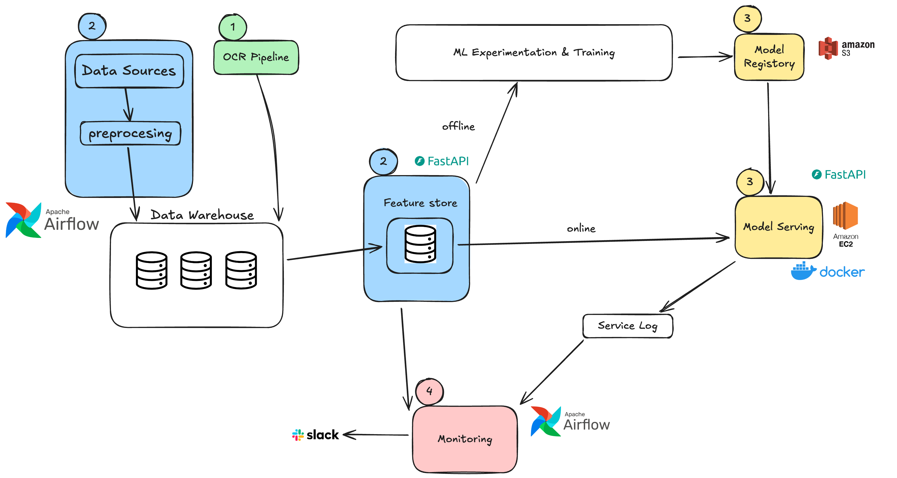

## 배경

서비스를 고도화하기 위해 기존에 배포되어 있는 모델의 성능을 확인하려고 했지만, 여러 문제들을 발견했습니다.
- 추론 상황에서의 로그와 이를 모니터링할 수 있는 기능이 없어서 실제 서비스에서의 성능을 확인할 수 없었음
- 기존에는 raw database에서 바로 데이터를 가져왔고, 이 과정에서 학습 상황과 추론 상황에서의 데이터가 일치하지 않는 문제
- 실험이 단순히 notebook 형태로만 존재해서 모델의 형상관리나 실험 추적이 어려움

이러한 문제들을 해결하기 위해 End-to-End ML system을 설계하고 구현했습니다.

<figure>

<figcaption>그림1. ML pipeline</figcaption>
</figure>

제가 구성하고 개발한 ML 파이프라인은 그림1과 같습니다. 1번 OCR 파이프라인에 대한 내용은 별도 포스트에서 확인할 수 있습니다.
- [portfolio - OCR pipeline 구현](/posts/Career/Portfolio/Scatch/visuworks_ocr_pipeline)

---

## 1. 데이터 일관성 확보 : data pipeline, feature store 구현

모델을 개발하면서 첫번째로 마주한 문제는 데이터 일관성 문제입니다.

기존에 회사에서 실험, 모델을 만들고 서빙할 때 개별적으로 DW (데이터웨어하우스)에서 데이터를 불러왔습니다. 이는 학습과 추론 상황에서의 데이터 일관성을 보장하지 못하며, 실제로 코드를 뜯어봤을 때 서로 다른 전처리 로직을 사용하고 있었습니다. 이렇게 사용했을 때 학습 상황에서 확인한 성능과 추론 성능이 굉장히 달라질 수 있습니다. 또한 실험하는 사람마다 다른 데이터 전처리 로직을 사용했기에 일관된 모델 성능을 파악하기도 어려웠습니다.

이를 해결하기 위해 데이터 파이프라인을 통해 데이터 전처리 과정을 통일했고, 피처 스토어를 통해 학습과 추론 상황에서의 데이터 일관성을 보장했습니다.

구현할 때는 유명한 프레임워크나 툴을 사용하기보다 현재 필요한 기능에 맞도록 구현했습니다. 필요없는 기술을 위해 복잡성을 증가시키지 않고, 해결하고자 하는 문제에 집중했습니다.

---

## 2. 모델 서빙

모델을 서빙할 때 고려했던 핵심 요소는 배포 환경의 일관성과 모델 업데이트의 용이성이었습니다.

컨테이너화를 통해 개발 환경과 운영 환경 간의 차이를 최소화하고, FastAPI를 사용하여 간단하면서도 효율적인 API 서버를 구축했습니다.

Docker를 활용한 배포로 인프라 관리의 복잡성을 줄이고, S3를 통해 모델 파일을 중앙 집중식으로 관리하여 새로운 모델 버전을 쉽게 배포할 수 있도록 했습니다. 이는 특히 모델 성능 개선 시 빠른 반영이 가능하게 해주었습니다.

---

## 3. Monitoring 구현

모델이 실제 서비스 상황에서 어떤 성능을 보이는지, 데이터 분포 변화가 있는지 등을 지속적으로 모니터링하는 것이 중요했습니다.

데이터는 시간이 지남에 따라 계속 변화하기 때문에, 학습 시점의 성능과 현재 성능 간의 차이가 발생할 수 있습니다. 이러한 변화를 놓치면 모델이 조용히 성능이 저하되는 silent failure 상황이 발생할 수 있어, 지속적인 모니터링과 필요시 재학습 과정이 필수적이었습니다.

구현한 모니터링 시스템은 크게 세 가지였습니다.
- **성능 모니터링** : 서비스 로그에 저장된 모델 추론값과 수술 후 실제 측정 결과값을 비교해서 평가지표들을 주기적으로 계산
- **Data Drift 감지** : 입력 데이터의 분포 변화를 감지해서 모델 성능 저하의 조기 경고 신호를 포착. 특히 피처별 통계량 변화와 분포 변화를 학습 시점과 비교
- **자동 알림 시스템** : 성능지표와 data drift에 대한 지표들을 지속적으로 확인

결과적으로 모델의 성능 변화를 사전에 감지할 수 있게 되어서, 성능 저하 시 즉시 대응할 수 있었습니다. 데이터 drift가 발생했을 때도 원인을 빠르게 파악하고 적절한 조치를 취할 수 있어서 모델의 안정성과 신뢰성을 크게 향상시킬 수 있었습니다.

개념에 대해서 제가 이해한 부분들을 정리한 내용입니다.
- [data drift란?](/posts/Data%20Science/Statistics/what-is-data-drift/)
- [silent failure에 대해서](/posts/Data%20Science/ML%20Engineering/about-silent-failures/)

---

## 4. 체계적인 실험 관리 : Hydra & W&B

기존에는 실험이 notebook 형태로만 존재해서 재현성을 보장하기 어렵고, 여러 실험을 비교하거나 추적하는 것이 어려웠습니다.

이를 해결하기 위해 Hydra를 활용해 실험 설정을 체계적으로 관리하고, W&B(Weights & Biases)를 통해 실험 결과를 추적하고 비교할 수 있도록 했습니다. Hydra를 통해 hyperparameter, 데이터 설정, 모델 설정 등을 config 파일로 관리하여 실험의 재현성을 보장했고, W&B를 통해 여러 실험의 성능 지표, 학습 곡선, 모델 artifact 등을 중앙에서 관리할 수 있게 되었습니다.

이를 통해 팀 내에서 실험 결과를 공유하고, 어떤 설정이 가장 좋은 성능을 냈는지 쉽게 비교할 수 있었습니다. 또한 서비스에 배포된 모델의 실험 결과를 언제든 확인할 수 있어, 추가적인 실험과 재학습의 과정이 훨씬 수월해졌습니다.

---

## 성과 및 배운 점

ML system을 End-to-End로 구축하면서 다음과 같은 성과를 달성할 수 있었습니다.

먼저 데이터 불일치에서 발생한 성능 저하 문제를 해결했습니다. 학습과 추론 상황에서 서로 다른 전처리 로직을 사용하면서 발생했던 **약 20%의 성능 저하**를 데이터 파이프라인과 feature store를 통해 해결할 수 있었습니다.

또한 실제 서비스 상황에서의 성능을 지속적으로 모니터링할 수 있게 되면서, 사용자의 만족도를 낮추는 silent failure 등을 사전에 감지하고 대응할 수 있게 되었습니다. 실험 관리 시스템을 통해 모델 개발과 재학습 과정도 체계화되어, 빠르게 모델을 개선하고 배포할 수 있는 환경을 구축했습니다.

이 과정을 통해 ML 서비스를 운영하기 위해 필요한 요소들을 깊이 이해할 수 있었습니다. 단순히 모델을 개발하는 것을 넘어서, 데이터 파이프라인, 모델 서빙, 모니터링, 실험 관리까지 End-to-End로 시스템을 개발하면서 각 단계에서 중요하게 고려해야 할 점들을 배울 수 있었습니다. 특히 실제 문제 상황을 마주하고 해결하면서 이론과 실무의 차이를 체감하고, 실용적인 해결책을 찾아가는 경험을 쌓을 수 있었습니다.

---

## 관련 문서

- [[Career/Project/LensSizing/프로젝트 설명|프로젝트 설명]]
- [[Career/Project/LensSizing/모델링 관련 정리|모델링 관련 정리]]
