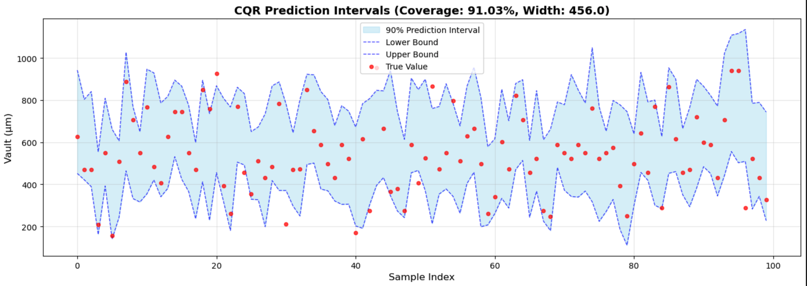

## 배경

서비스의 만족도를 높이기 위해 사용자의 요구사항을 더 깊게 이해하려고 했습니다.

기존에는 단순히 예측값(평균)을 제공하고 MAE 개선에 집중했지만, 사용자의 요구사항을 자세히 듣고 분석한 결과 단순히 하나의 예측값을 제공받는 것보다 실제로 가능한 값의 범위를 알고 싶어 한다는 점을 확인했습니다.

그러나 기존 접근은 MAE를 개선하는 데만 초점을 맞추고 있었고, 모델의 R² 값이 약 0.4 수준으로 전체 분산의 40%만 설명할 수 있었습니다. 결과적으로 단일 예측값만 제공하는 것은 모델의 한계를 드러내고 사용자의 신뢰도를 오히려 떨어뜨릴 수 있었습니다.

이러한 문제를 해결하기 위해 예측값 대신 일정 신뢰수준을 만족하는 예측 구간을 제시하는 방향으로 접근을 전환했습니다. 그림1과 같은 형태로, 신뢰수준 0.9를 만족하기 위해 0.05와 0.95 quantile을 예측해 예측구간을 추정합니다.

<figure>

<figcaption>그림1. CQR로 예측 구간 추정</figcaption>
</figure>

---

## 1. Quantile Regression으로 문제 재정의

기존의 점 추정(point estimation) 문제를 quantile regression task로 재정의했습니다.

이를 통해 단일 예측값이 아닌, 사이즈별로 데이터 분포를 고려한 예측 구간을 산출할 수 있게 되었습니다. 사용자는 이러한 구간 정보를 통해 결과를 더 직관적으로 이해하고 활용할 수 있게 되었습니다.

구체적으로 예측 구간(Prediction Interval)을 그려주기 위해 Quantile Regressor를 사용했습니다. 그 후에 Conformal prediction의 개념을 도입해 원하는 신뢰수준을 만족하는 예측구간을 추정할 수 있도록 했습니다.

개념에 대해서 제가 이해한 부분들을 정리한 내용입니다.
- [Quantile Regression이란?](/posts/Data%20Science/ML%20Engineering/quantile-regression-explained)
- [Conformal prediction이란?](/posts/Data%20Science/ML%20Engineering/quantile_regression/conformal-prediction-explained.md)

---

## 2. 새로운 평가지표 설계

문제를 재정의하면서 평가지표 역시 재설계했습니다.

단순 오차 기반(MAE)에서 벗어나, 예측 구간이 실제 데이터를 얼마나 포함하는지를 나타내는 **포함률(coverage)**과 **예측 구간의 길이(interval width)**를 새로운 핵심 지표로 정의했습니다.

포함률은 예측 구간이 실제 값을 얼마나 잘 포함하는지를 측정하여 모델의 신뢰도를 평가하고, 구간의 길이는 예측의 불확실성 정도를 나타내어 사용자에게 얼마나 유용한 정보를 제공하는지를 평가합니다. 이 두 지표를 함께 사용함으로써, 단순히 정확한 예측뿐만 아니라 사용자에게 실질적으로 유용한 예측을 제공할 수 있게 되었습니다.

이러한 평가지표는 실제 사용자 만족도와 정렬되어 있어, 비즈니스 목표를 달성하는 데 기여할 수 있었습니다.

---

## 3. 추상화된 모델 파이프라인 구축

여러 분위수를 추정하는 과정에서 분위수끼리의 순서가 맞지 않는 **quantile crossing problem**이 발생했습니다. 예를 들어, 10% 분위수의 예측값이 90% 분위수의 예측값보다 큰 경우가 발생하는 것입니다. 이는 통계적으로 말이 되지 않으며, 사용자의 신뢰도를 하락시킬 수 있는 심각한 문제였기 때문에 반드시 해결해야 했습니다.

앞선 문제들을 해결하고, 원하는 신뢰수준(Confidence Level)을 만족하는 예측 구간을 생성하기 위해 **추상화된 모델 파이프라인**을 개발했습니다.

### 기술적 접근: Quantile Regression & CQR

예측 구간을 생성하기 위해 **Quantile Regression**을 기본 모델로 사용했습니다. 일반적인 MSE(Mean Squared Error) 대신, 각 분위수(Quantile)를 추정할 수 있는 Loss Function을 사용하여 모델을 학습시켰습니다. 특히 이상치(Outlier)에 강건한 모델을 만들기 위해 **Huber Loss**를 기반으로 한 Quantile Loss를 적용했습니다.

하지만 단순히 Quantile Regression만으로는 실제 데이터의 분포를 완벽하게 커버하지 못하는 경우(Under-coverage)가 발생했습니다. 이를 보완하기 위해 **Conformal Prediction(CQR, Conformalized Quantile Regression)** 기법을 도입했습니다.

CQR은 Calibration Set을 활용하여 모델의 예측 구간을 보정하는 기법입니다.
1. Calibration Set에서 모델이 예측한 구간과 실제 값 사이의 차이(Score)를 계산합니다.
2. 이 Score들의 분포에서 특정 분위수(예: 90% 신뢰수준이라면 상위 10% 지점)를 찾아 보정값(Conformity Score)을 산출합니다.
3. 최종적으로 모델의 예측 구간에 이 보정값을 더하고 빼줌으로써, **통계적으로 유효한 신뢰수준을 보장하는 예측 구간(Conformal Set)**을 생성합니다.

이 과정을 파이프라인으로 추상화하여, 데이터의 특성과 사용자의 요구사항(목표 신뢰수준)에 맞춰 유연하게 예측 구간을 생성할 수 있는 구조를 만들었습니다.

<details>
<summary><strong>코드: Quantile Loss & CQR 핵심 로직 (Click to expand)</strong></summary>

```python
# 1. Pinball Loss (Quantile Loss) 구현
def quantile_loss(preds, target, quantiles):
    errors = target - preds
    # 각 quantile별 loss 계산 (max(q*e, (q-1)*e))
    losses = torch.max((quantiles - 1) * errors, quantiles * errors)
    return torch.abs(losses).mean()

# 2. CQR Calibration (Conformal Prediction)
def calibrate(self, calibration_X, calibration_y, alpha=0.1):
    # Calibration set에 대한 예측 구간 생성
    lower, upper = self.predict_intervals(calibration_X)
    
    # 실제 값이 예측 구간을 벗어난 정도(Score) 계산
    scores = torch.max(lower - calibration_y, calibration_y - upper)
    
    # (1-alpha) 분위수 계산하여 보정값(q_hat) 도출
    q_hat = torch.quantile(scores, 1 - alpha)
    return q_hat
```

</details>

또한 앞서 언급한 Quantile Crossing 문제를 방지하는 로직도 이 파이프라인 내부에 통합했습니다.

결과적으로, 사용자는 "이 렌즈를 썼을 때 Vault가 90% 확률로 250~500 사이일 것입니다"와 같은 구체적이고 신뢰할 수 있는 정보를 제공받을 수 있게 되었습니다. 이는 단순 예측값 하나를 던져주는 것보다 훨씬 더 의사결정에 도움이 된다는 피드백을 받았습니다.

---

## 성과 및 배운 점

이 프로젝트를 통해 **"불확실성(Uncertainty)을 다루는 법"**을 깊이 있게 배웠습니다.

단순히 모델의 정확도(MAE, MSE)를 높이는 것을 넘어, 모델이 자신의 예측을 얼마나 확신하는지를 정량화하여 사용자에게 전달하는 것이 실제 비즈니스 현장에서 얼마나 강력한 가치를 지니는지 체감했습니다.

또한, 복잡한 통계적 개념(Quantile Regression, CQR)을 실제 서비스 가능한 형태의 **추상화된 파이프라인**으로 구현해내면서, 이론을 제품으로 연결하는 엔지니어링 역량을 한 단계 성장시킬 수 있었습니다. 무엇보다 "정확한 예측"이 불가능한 상황에서도 "신뢰할 수 있는 정보"를 제공함으로써 문제를 해결할 수 있다는 중요한 인사이트를 얻었습니다.

---

## 관련 문서

- [[Career/Project/LensSizing/프로젝트 설명|프로젝트 설명]]
- [[Career/Project/LensSizing/양수성 개념 도입 시도|양수성 개념 도입 시도]]
- [[Career/Project/LensSizing/만족도 개선 인터뷰|만족도 개선 인터뷰]]
