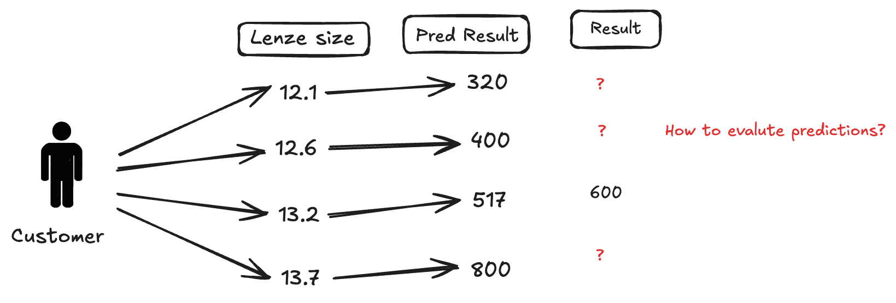
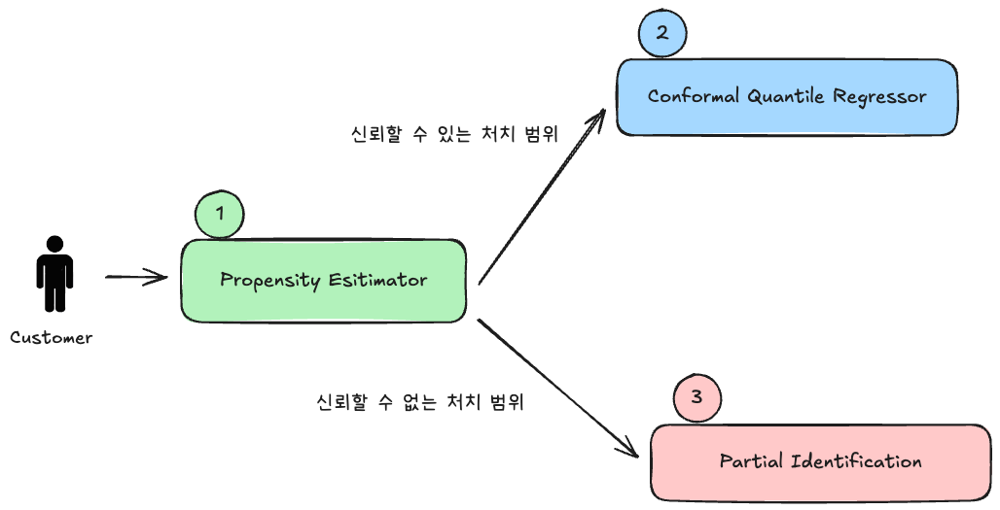
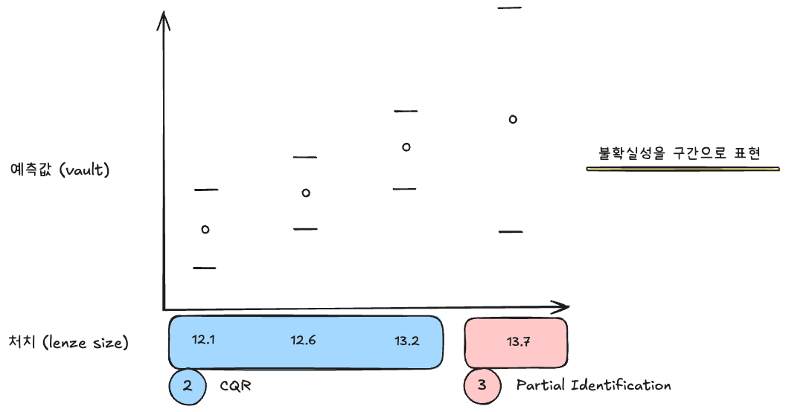
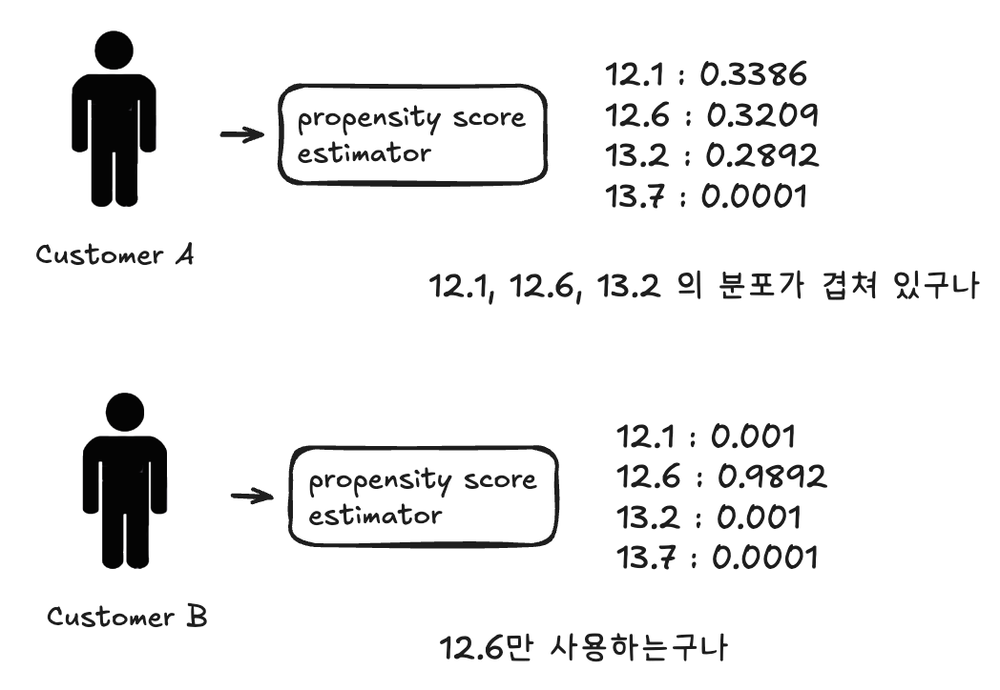

## 배경

다음과 같은 의문을 문제로 정의해서 풀고자 했습니다.
- 측정하지 않은 값에 대한 예측 성능을 어떻게 평가할 수 있을까?
- 눈이 작은 환자에게는 큰 렌즈를 넣은 데이터가 없는데, 추론 상황에서 이를 신뢰할 수 있을까?

이를 해결하기 위해 인과추론의 관점에서 "양수성"이라는 개념을 사용해 문제를 정의했습니다.

<figure>

<figcaption>그림1. 고민했던 문제 : 어떻게 평가할 것인가, 어디까지 신뢰할 수 있는지</figcaption>
</figure>

문제 상황을 그려보면 그림1과 같습니다. 선택할 수 있는 "렌즈 사이즈"는 3가지가 있고, 의사는 3가지 중 하나를 선택해 수술을 진행하게 됩니다.

3가지에 대한 예측값을 모두 생성하지만, 실제 결과는 1개만 알 수 있습니다. 이때 실제 결과가 없는 나머지 예측들은 어떻게 평가할 수 있을지에 대한 의문이 들었습니다.

> 즉, 학습 데이터셋에는 고객별로 1개의 렌즈 사이즈에 대한 결과만 존재하는데, 나머지 사이즈에 대한 예측값은 어떻게 신뢰할 수 있지? 라는 의문이 들었습니다.

이에 대한 답을 "양수성" 혹은 "분포의 겹침"에서 찾을 수 있었습니다.
- [양수성에 대해 정리한 글](/posts/Data%20Science/Causal%20Inference/what-is-positivity)

양수성은 모든 개체가 모든 처치(treatment)를 받을 수 있는 가능성이 있어야 한다는 가정입니다. 렌즈 사이즈 선택 문제에서 각 환자가 각 렌즈 사이즈를 받을 수 있는 **가능성**이 있어야 한다는 의미입니다. 만약 특정 환자에게는 절대 사용하지 않은 렌즈 사이즈가 있다면, 예측값을 신뢰할 수 없을 것입니다.

양수성을 만족한다면 **관찰되지 않은 사이즈에 대한 예측도 신뢰할 수 있다**고 이야기할 수 있습니다.

---

## 추론 로직 구조

<figure>

<figcaption>그림2. 추론할 때의 로직</figcaption>
</figure>

양수성을 고려한 추론 로직부터 그려보면 그림2와 같습니다. propensity score를 추정해, 고객에 대해 신뢰할 수 있는 처치범위와 그렇지 않은 범위를 정하고, 각각에 따라 다른 예측 모델을 사용하고 있습니다.

<figure>

<figcaption>그림3. 양수성 조건에 따른 예측</figcaption>
</figure>

양수성 혹은 분포의 겹침이 보장되어 신뢰할 수 있는 처치의 범위는 CQR을 통해 예측 범위를 추정하고, 그렇지 않은 곳은 partial identification의 아이디어를 차용해 예측 범위를 추정할 수 있습니다. 이를 통해 예측의 불확실성을 구간으로 표현할 수 있을 것이라고 생각했습니다.

---

## 신뢰할 수 있는 처치의 범위 : Propensity Estimator

가장 먼저 예측 평가지표 (MSE, MAE)로 성능을 확인한 예측의 범위를 정해야 합니다. 이는 성향 점수 (propensity score)를 추정함으로써 정할 수 있습니다. 성향 점수는 처치를 선택할 확률을 의미하며, $P(T|X)$을 추정하는 문제입니다.

성향 점수 추정 모델로 고객별로 데이터에서 처치의 분포가 겹치는 범위를 정할 수 있습니다. (인과추론의 가장 기본적인 가정인 양수성을 만족하는 범위를 찾는다고도 할 수 있습니다)

<figure>

<figcaption>그림4. 양수성 조건 만족하는 범위</figcaption>
</figure>

그림4는 고객별로 성향점수를 추정하고, 이를 통해 양수성이 보장되는 처치의 범위를 정한 예시입니다.

고객 A는 12.1, 12.6, 13.2에 대한 예측 성능을 신뢰할 수 있고, 고객 B는 12.6에 대한 예측값을 신뢰할 수 있다고 판단할 수 있습니다.

---

## 신뢰할 수 없는 범위의 예측 : Partial Identification

신뢰할 수 있는 정도를 예측 범위로 나타낼 수 있고, 따라서 양수성이 보장되지 않는 예측 범위의 예측 범위를 넓게 그려주고자 했습니다. 양수성이 보장되는 처치의 예측값은 신뢰구간을 예측해 보여주고, 나머지 처치에 대해서는 "partial identification"과 같은 개념을 사용해 예측 범위를 추정했습니다.

개념에 대해서 제가 이해한 부분들을 정리한 내용입니다.
- [Partial Identification이란?](/posts/Data%20Science/Causal%20Inference/what-is-partial-identification)
- [Manski Bounds란?](/posts/Data%20Science/Causal%20Inference/what-is-manski-bounds)

---

## 실패로부터의 배움

이 접근은 실제 서비스에 적용하지는 못했습니다. 여러 제약 (데이터 양, 계산 복잡도, 사용자 검증 비용)으로 인해 본격적인 도입은 보류되었으나, 이 과정을 통해 얻은 통찰이 있습니다.

- 데이터가 없는 영역에 대해 "모른다"고 명시적으로 표현하는 것이 "억지로 예측값을 만드는 것"보다 나을 수 있다는 관점
- 이는 이후 Quantile Regression 기반의 **예측 구간 추정**으로 문제를 재정의하는 데 밑거름이 되었습니다

관련 연구 방향:
- [연구 방향에 대해 정리한 글 - 외삽 문제를 어떻게 다뤄야할까?](/posts/Data%20Science/Causal%20Inference/Industry%20Application/what-can-I-do-in-extrapolation-problem)

---

## 관련 문서

- [[Career/Project/LensSizing/프로젝트 설명|프로젝트 설명]]
- [[Career/Project/LensSizing/Quantile Regression 및 CQR 파이프라인|Quantile Regression 및 CQR 파이프라인]]
