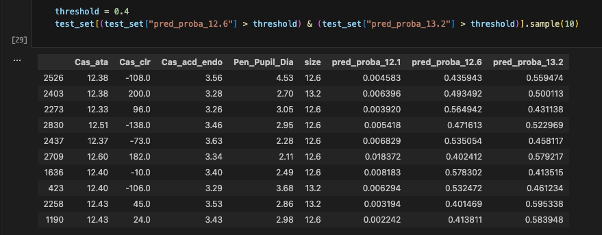

---
title: "선택 문제에서 모델을 어떻게 평가할 것인가"
date: "2025-08-11"
excerpt: "선택 문제에서 모델을 평가하는 방법에 대한 정리"
category: "Causal Inference"
tags: ["evaluation"]
--- 

# 문제정의

<figure>
    
    <figcaption>그림1. 선택의 문제에서 평가에 대한 고민</figcaption>
</figure>

선택의 문제에서 모델의 예측 결과를 평가하는 일은 꽤나 어려운 일입니다.
왜냐하면 고객은 여러가지 선택 중에서 하나의 선택만 하기 때문이죠.

그림1은 제가 풀고 있는 문제를 시각화한 자료입니다.
시력교정 도메인에서 의사는 고객에게 최적화된 렌즈 크기를 선택하게 됩니다.
이때 선택에 도움을 주기 위해서 결과를 추정하는 모델을 개발하고 있습니다.

모델의 결과 추정치를 평가하는데 한 가지 이슈가 있습니다.
하나의 예측값에 대한 실제 값만을 알 수 있기 때문입니다.
그림1에서는 output 2에 대한 실제 결과를 확인할 수 있고, output1과 output3에 대한 실제 결과는 확인할 수 없습니다.

이런 선택의 문제에서 모델의 성능은 어떻게 평가할 수 있을까요?

# 처치별 환자의 분포가 겹친다면, RCT 상황에서 생각해보기

*RCT(Randomized Controlled Trial) : 무작위 배정 시험. 

무작위로 처치에 배정된 경우를 생각해보겠습니다.
무작위로 배정되었기 때문에 처치별 환자의 분포가 비슷하게 형성되었을 것입니다.

A라는 고객은 12.1로 수술을 받았지만,
A와 비슷한 A'는 12.6으로 수술을 받았을 것이고,
A와 비슷한 A"는 13.2로 수술을 받았을 것입니다.
따라서 A에 대해서는 12.1 밖에 수술 결과가 없지만, 나머지 12.6과 13.2에 대한 예측결과를 간접적으로 확인할 수 있습니다.

다르게 표현하면, A라는 고객이 각 처치를 받을 확률이 비슷하다면, 그 처치에 대한 예측값을 간접적으로 평가할 수 있고 신뢰할 수 있습니다.

인과추론에서는 이를 다음과 같이 표현합니다.
> positivity/overlap assumption and the common support region.

# 처치별 고객의 분포가 겹치지 않는다면, 실제 상황에서 생각해보기

당연하게도 실제 상황은 RCT 와 다릅니다.
의사는 고객의 상태를 보고 처치를 결정하기 때문입니다.

<figure>
  
  <figcaption>그림 2: 처치별 Feature 분포 비교</figcaption>
</figure>

특히 눈의 크기(ata)를 통해 렌즈 크기의 범위를 결정합니다.
그림 2를 통해 이를 확인할 수 있습니다.

12.1을 선택하는 눈의 크기 (Cas_ata) 분포와 13.2를 선택하는 눈의 크기 분포는 꽤나 다릅니다.
거의 겹쳐져 있지 않습니다.

이렇게 13.2를 받을 확률이 매우 낮은 고객의 13.2에 대한 모델의 예측값은 간접적으로도 평가할 수 없고, 이를 신뢰하기 어려울 것입니다.

# 겹치는 정도, 처치를 선택할 확률을 구하는 방법

특정 고객이 어떤 처치를 받을 확률은 모델을 통해 추정할 수 있습니다.
X를 고객의 눈의 상태로, Y를 처치로 두고 모델을 학습시키면 됩니다.

<figure>
  
  <figcaption>그림 3: 12.1과 12.6이 겹치는 고객 (처치 : size, 나머지는 고객 눈의 조건)</figcaption>
</figure>

<figure>
  
  <figcaption>그림 4: 12.6과 13.2가 겹치는 고객 (처치 : size, 나머지는 고객 눈의 조건)</figcaption>
</figure>

그림3과 그림4는 확률추정 모델을 만든 후, 모델을 통해 확률값을 구해 필터링한 결과입니다.

그림3의 경우 12.1과 12.6을 받을 확률이 0.4 이상인 고객들입니다.
이런 고객들의 경우 12.1과 12.6에 대한 예측값을 간접적으로 평가할 수 있고, 신뢰할 수 있습니다.
13.2의 경우에는 신뢰할 수 없을 것입니다.

# 예측의 불확실성을 표현하는 방법
그렇다면 이런 직관을 수학적으로 표현할 수 있을까요? 예측값의 불확실성을 어떻게 표현할 수 있을까요?

## GPT-5 의견
- 신뢰도(confidence) = Overlap × Predictive Uncertainty 반영
  - Overlap 기반 신뢰도: 
    - 추천 후보 상위 2개 처치 `t1, t2`에 대해 `min(P_hat(t1|x), P_hat(t2|x))`가 높을수록 신뢰도↑
  - 예측 불확실성:
    - 앙상블/MC Dropout 분산, 또는 Quantile Regression으로 예측구간 산출

- 표시 방법:
  - 신뢰도 낮은 처치는 회색 처리 또는 주석(“데이터 부족/overlap 부족”)
  - 신뢰도와 함께 예측구간 표시

$$
\text{Confidence}(x, t) \;=\; \underbrace{\min_{t \in \mathcal{C}(x)} \hat{P}(t \mid x)}_{\text{overlap}}
\;\times\;
\underbrace{g\!\left(\frac{1}{1 + \sigma^2_{\hat{y}_t}(x)}\right)}_{\text{uncertainty}}
$$

여기서 $\mathcal{C}(x)$는 추천 후보 처치 집합, $sigma^2_{\hat{y}_t}(x)$는 (앙상블/MC Dropout/분위수 회귀 등으로 추정한) 예측 분산이며, $g(\cdot)$는 0–1 정규화 함수입니다.

## 내 생각, 분산으로 표현하기

제가 원하는 방향은 prediction interval을 구하는 것입니다.
그리고 여기에 overlap 정도가 반영되어서, 앞서 언급한 예시처럼 13.2를 받을 확률이 매우 낮은 고객의 13.2에 대한 분산은 매우 크게 계산 됐으면 좋겠습니다.

이를 어떻게 정의하고 나타낼 수 있을지는 아직 찾아보면서 고민하고 있습니다.

