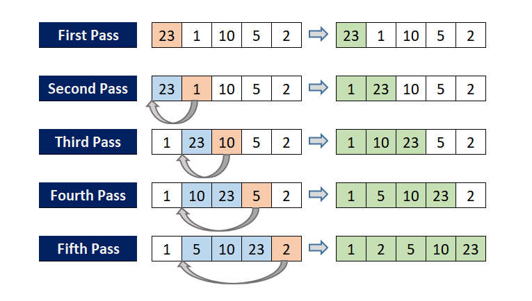

정렬 알고리즘 별로 이해하기. 
차이가 뭔지, 각 알고리즘의 lower bound 이해하기.

## 정렬 알고리즘 비교

| 알고리즘 | 최선 시간 복잡도 | 평균 시간 복잡도 | 최악 시간 복잡도 | 공간 복잡도 | Stable | In-place | 특징 |
|---------|----------------|----------------|----------------|------------|--------|----------|------|
| Insertion Sort | O(n) | O(n²) | O(n²) | O(1) | O | O | 거의 정렬된 데이터에 효율적 |
| Selection Sort | O(n²) | O(n²) | O(n²) | O(1) | X | O | 항상 동일한 비교 횟수 |
| Bubble Sort | O(n) | O(n²) | O(n²) | O(1) | O | O | 구현이 간단하지만 비효율적 |
| Merge Sort | O(n log n) | O(n log n) | O(n log n) | O(n) | O | X | 안정적이고 예측 가능한 성능 |
| Quick Sort | O(n log n) | O(n log n) | O(n²) | O(log n) | X | O | 평균적으로 가장 빠름 |
| Heap Sort | O(n log n) | O(n log n) | O(n log n) | O(1) | X | O | 최악의 경우에도 O(n log n) 보장 |
| Counting Sort | O(n+k) | O(n+k) | O(n+k) | O(k) | O | X | 정수 정렬에 효율적 (k는 범위) |
| Topological Sort | O(V+E) | O(V+E) | O(V+E) | O(V) | - | - | DAG의 선형 순서 결정 |


### 비교 정렬 (Comparison Sort) vs 비비교 정렬 (Non-Comparison Sort)

정렬 알고리즘은 원소 간의 비교 연산 사용 여부에 따라 두 가지로 분류된다.

#### 비교 정렬 (Comparison Sort)

두 원소를 직접 비교하여 크기 관계를 판단하고 정렬하는 방식이다. 대부분의 일반적인 정렬 알고리즘이 여기에 속한다.

**특징:**
- 원소 간의 상대적 순서를 비교 연산으로 결정
- 어떤 자료형이든 비교 가능하면 정렬 가능
- 시간 복잡도의 이론적 하한(lower bound)이 존재

**비교 정렬의 예:**
- Insertion Sort
- Merge Sort  
- Quick Sort
- Heap Sort
- Bubble Sort
- Selection Sort

#### 비비교 정렬 (Non-Comparison Sort)

원소 간의 직접 비교 없이 다른 방법(카운팅, 자릿수 등)으로 정렬하는 방식이다. 특정 조건에서 비교 정렬의 하한을 뛰어넘을 수 있다.

**특징:**
- 원소의 값 자체를 이용하여 정렬 (카운팅, 인덱싱 등)
- 특정 조건이나 제약이 있어야 사용 가능
- 비교 정렬의 하한인 O(n log n)을 뛰어넘을 수 있음

**비비교 정렬의 예:**
- Counting Sort (계수 정렬)
- Radix Sort (기수 정렬)
- Bucket Sort (버킷 정렬)

#### 비교 정렬의 하한 (Lower Bound): O(n log n)

비교 정렬 알고리즘은 아무리 최적화해도 최악의 경우 O(n log n)보다 빠를 수 없다. 이는 결정 트리(decision tree) 모델을 통해 증명할 수 있다.

**증명:**

n개의 서로 다른 원소를 정렬하는 과정을 이진 결정 트리로 표현할 수 있다. 각 내부 노드는 두 원소의 비교를 나타내고, 리프 노드는 가능한 정렬 결과(순열)를 나타낸다.

1. **가능한 결과의 수**: n개 원소의 모든 가능한 순열은 n! 개

2. **트리의 리프 노드 수**: 최소 n! 개의 리프 노드가 필요 (각 순열마다 하나씩)

3. **이진 트리의 높이**: 높이 h인 이진 트리는 최대 2^h개의 리프 노드를 가질 수 있음

4. **높이의 하한**:
   - 2^h ≥ n!
   - h ≥ log₂(n!)

5. **Stirling's approximation 적용**:

$$
\log_2(n!) = \log_2(1 \times 2 \times 3 \times \cdots \times n)
$$

$$
\log_2(n!) \approx n\log_2(n) - n\log_2(e)
$$

$$
\log_2(n!) = \Theta(n \log n)
$$

따라서 비교 정렬의 최소 비교 횟수는 Ω(n log n)이다.

**직관적 이해:**

n개 원소의 순열은 n! = n × (n-1) × ... × 2 × 1 가지가 있다. 각 비교 연산은 결과를 최대 2가지로 나눈다(A < B 또는 A ≥ B). k번 비교하면 최대 2^k가지 경우를 구분할 수 있다. 따라서:

$$
2^k \geq n! \quad \Rightarrow \quad k \geq \log_2(n!) = \Theta(n \log n)
$$

#### 비비교 정렬이 더 빠를 수 있는 이유

비비교 정렬은 원소를 직접 비교하지 않고 다른 정보(값의 범위, 자릿수 등)를 활용하므로 결정 트리 모델의 제약을 받지 않는다.

예를 들어 Counting Sort는:
- 비교 연산 없이 카운팅과 인덱싱만 사용
- 데이터 범위가 k일 때 O(n + k) 시간
- k ≈ n이면 O(n) 달성 가능

하지만 이는 다음과 같은 제약 조건이 필요하다:
- 정수 또는 정수로 매핑 가능한 데이터
- 데이터 범위가 제한적
- 추가 메모리 사용 가능

#### 비교표

| 구분 | 비교 정렬 | 비비교 정렬 |
|------|-----------|-------------|
| **원리** | 원소 간 크기 비교 | 값 자체를 활용 (카운팅, 자릿수 등) |
| **시간 하한** | O(n log n) | 조건에 따라 O(n) 가능 |
| **적용 범위** | 비교 가능한 모든 자료형 | 제한적 (주로 정수) |
| **공간 복잡도** | 알고리즘에 따라 다름 | 보통 추가 메모리 필요 |
| **예시** | Quick, Merge, Heap Sort | Counting, Radix, Bucket Sort |
| **안정성** | 알고리즘에 따라 다름 | 대부분 안정 정렬 가능 |

#### 정렬 알고리즘 선택 가이드

**비교 정렬을 사용할 때:**
- 일반적인 정렬 문제
- 다양한 자료형 (문자열, 객체 등)
- 데이터 범위를 알 수 없을 때
- Stable sort가 필요할 때 (Merge Sort)
- In-place가 필요할 때 (Quick Sort, Heap Sort)

**비비교 정렬을 사용할 때:**
- 정수 배열 정렬 (데이터 범위가 작을 때)
- O(n) 성능이 필요할 때
- 데이터의 특성(범위, 분포)을 알고 있을 때
- 예: 나이(0~120), 점수(0~100), 작은 범위의 양의 정수


### 용어 설명

**In-place 정렬**

In-place 정렬은 입력 배열 외에 추가적인 메모리 공간을 거의 사용하지 않고 정렬하는 알고리즘을 말한다. 정확히는 O(1)의 추가 공간만 사용한다. 원본 배열 내에서 원소들의 위치를 직접 변경하면서 정렬을 수행한다.

예를 들어 insertion sort는 in-place 알고리즘이다. 배열 내에서 원소를 직접 이동시키며 정렬한다:
```python
# in-place: 원본 배열을 직접 수정
arr = [5, 2, 4]
for i in range(1, len(arr)):
    key = arr[i]  # 임시 변수 1개만 사용
    j = i - 1
    while j >= 0 and arr[j] > key:
        arr[j + 1] = arr[j]  # 원본 배열에서 직접 이동
        j -= 1
    arr[j + 1] = key
# arr가 직접 수정됨
```

반면 merge sort는 in-place가 아니다. 병합 과정에서 크기 n만큼의 추가 배열이 필요하다:
```python
# Not in-place: 새로운 배열을 계속 생성
def merge(left, right):
    result = []  # 매번 새 배열 생성 (O(n) 공간)
    # ... 병합 로직
    return result  # 새 배열 반환
```

**Stable 정렬**

Stable 정렬은 동일한 값을 가진 원소들의 상대적 순서가 정렬 후에도 유지되는 알고리즘을 말한다. 

예시:
```python
# 원본: [(값, 원래순서)]
arr = [(3, 'a'), (1, 'b'), (3, 'c'), (2, 'd')]

# Stable sort 후: 값 3인 원소들의 순서 유지 (a가 c보다 앞)
# [(1, 'b'), (2, 'd'), (3, 'a'), (3, 'c')]

# Unstable sort 후: 값 3인 원소들의 순서가 바뀔 수 있음
# [(1, 'b'), (2, 'd'), (3, 'c'), (3, 'a')]  ← 가능
```

Stable 정렬은 여러 기준으로 연속해서 정렬할 때 중요하다. 예를 들어 이름순 정렬 후 나이순으로 정렬할 때, stable sort를 사용하면 같은 나이 내에서 이름순 정렬이 유지된다.

---

# 1. 삽입 정렬 (insertion sort)

<figure>

<figcaption>그림1. 삽입 정렬</figcaption>
</figure>

배열을 순회하면서 각 원소를 이미 정렬된 앞부분의 적절한 위치에 삽입하는 방식으로 정렬한다. 현재 원소를 정렬된 부분과 비교하면서 왼쪽으로 이동시켜 올바른 위치를 찾는다.

## 동작 원리

배열을 정렬된 부분과 정렬되지 않은 부분으로 나누고, 정렬되지 않은 부분의 첫 번째 원소를 정렬된 부분의 적절한 위치에 삽입하는 과정을 반복한다. 마치 카드 게임에서 손에 든 카드를 정렬하는 방식과 유사하다.

**알고리즘 단계:**
1. 두 번째 원소부터 시작 (첫 번째 원소는 이미 정렬된 것으로 간주)
2. 현재 원소를 key로 저장
3. key를 정렬된 부분의 원소들과 뒤에서부터 비교하면서 key보다 큰 원소들을 한 칸씩 오른쪽으로 이동
4. 적절한 위치를 찾으면 key를 삽입
5. 마지막 원소까지 반복

## 시간 복잡도 분석

- **최선의 경우 O(n)**: 이미 정렬된 배열. 각 원소마다 한 번씩만 비교
- **평균의 경우 O(n²)**: 평균적으로 각 원소를 정렬된 부분의 중간 정도까지 비교
- **최악의 경우 O(n²)**: 역순으로 정렬된 배열. i번째 원소를 삽입할 때 i번 비교

## 구현 예시

```python
def insertion_sort(arr):
    for i in range(1, len(arr)):
        key = arr[i]  # 현재 삽입할 원소
        j = i - 1
        
        # key보다 큰 원소들을 한 칸씩 뒤로 이동
        while j >= 0 and arr[j] > key:
            arr[j + 1] = arr[j]
            j -= 1
        
        # 적절한 위치에 key 삽입
        arr[j + 1] = key
    
    return arr

# 예시
arr = [5, 2, 4, 6, 1, 3]
print(insertion_sort(arr))  # [1, 2, 3, 4, 5, 6]
```

## 특징

**장점:**
- 구현이 간단하고 직관적
- stable sort (동일한 값의 상대적 순서 유지)
- in-place sort (추가 메모리 거의 불필요)
- 거의 정렬된 데이터에 대해 매우 효율적 (O(n)에 가까움)
- 작은 크기의 배열에 효율적

**단점:**
- 평균 및 최악의 경우 시간 복잡도가 O(n²)로 비효율적
- 큰 데이터셋에는 부적합

**사용 케이스:**
- 데이터가 거의 정렬되어 있을 때
- 배열 크기가 작을 때 (보통 10~20개 이하)
- Quick Sort나 Merge Sort의 재귀 깊이가 깊어질 때 하이브리드 방식으로 활용

---

# 2. 병합 정렬 (merge sort)

<figure>

<figcaption>그림2. 병합 정렬</figcaption>
</figure>

분할 정복(divide and conquer) 방식을 사용하는 대표적인 정렬 알고리즘이다. 배열을 반으로 나누어 각각을 정렬한 후 병합하는 과정을 재귀적으로 반복한다. 배열을 더 이상 나눌 수 없을 때까지 분할한 뒤, 작은 단위부터 정렬하면서 합치는 방식으로 전체를 정렬한다.

## 동작 원리

배열을 절반으로 나누는 분할 단계와 정렬된 부분 배열들을 합치는 병합 단계로 구성된다. 재귀적으로 배열을 절반씩 나누어 크기가 1이 될 때까지 분할하고, 각 부분을 정렬하면서 병합해나간다. 두 개의 정렬된 배열을 하나의 정렬된 배열로 합치는 병합 과정이 핵심이다.

**알고리즘 단계:**
1. 배열을 절반으로 분할 (분할 정복의 "분할" 단계)
2. 각 부분 배열에 대해 재귀적으로 병합 정렬 수행
3. 크기가 1인 배열이 될 때까지 분할 계속
4. 정렬된 두 부분 배열을 병합하여 하나의 정렬된 배열 생성 (분할 정복의 "정복" 단계)
5. 전체 배열이 정렬될 때까지 병합 과정 반복

## 시간 복잡도 분석

병합 정렬의 시간 복잡도는 모든 경우에 일정하다. 배열을 분할하는 깊이는 $\log n$이고, 각 레벨에서 전체 원소를 한 번씩 비교하므로 $n$번의 연산이 필요하다.

- **최선의 경우 O(n log n)**: 이미 정렬된 배열이어도 동일한 분할과 병합 과정을 거침
- **평균의 경우 O(n log n)**: 모든 경우에 동일한 비교 횟수
- **최악의 경우 O(n log n)**: 역순으로 정렬된 배열이어도 동일한 시간 복잡도

### 시간 복잡도 계산 과정

병합 정렬의 시간 복잡도를 이해하려면 재귀 트리를 그려보면 명확하다.

**1. 재귀 트리의 깊이 계산**

배열을 계속 절반으로 나누면:
- 처음: n개 원소
- 1단계: n/2개씩 2개
- 2단계: n/4개씩 4개
- 3단계: n/8개씩 8개
- ...
- k단계: n/2^k개씩 2^k개

크기가 1이 될 때까지 나누므로: $n/2^k = 1$ → $n = 2^k$ → $k = \log_2 n$

따라서 재귀 트리의 깊이는 $\log n$이다.

**2. 각 레벨의 작업량 계산**

각 레벨에서 병합 작업을 수행할 때:
- 0단계 (최상위): n개 원소 병합 → O(n) 작업
- 1단계: n/2개씩 2번 병합 → 2 × O(n/2) = O(n) 작업
- 2단계: n/4개씩 4번 병합 → 4 × O(n/4) = O(n) 작업
- k단계: n/2^k개씩 2^k번 병합 → 2^k × O(n/2^k) = O(n) 작업

**핵심**: 각 레벨마다 정확히 n개의 원소를 병합하므로 O(n)의 작업이 필요하다.

**3. 전체 시간 복잡도**

$$
\text{전체 시간} = \text{레벨 수} \times \text{레벨당 작업량} = \log n \times n = O(n \log n)
$$


## 구현 예시

```python
def merge_sort(arr):
    # 기저 조건: 크기가 1 이하면 이미 정렬됨
    if len(arr) <= 1:
        return arr
    
    # 분할 단계: 배열을 절반으로 나눔
    mid = len(arr) // 2
    left = arr[:mid]
    right = arr[mid:]
    
    # 재귀적으로 각 부분 정렬
    left = merge_sort(left)
    right = merge_sort(right)
    
    # 병합 단계: 정렬된 두 배열을 합침
    return merge(left, right)

def merge(left, right):
    result = []
    i = j = 0
    
    # 두 배열을 비교하면서 작은 원소부터 결과 배열에 추가
    while i < len(left) and j < len(right):
        if left[i] <= right[j]:
            result.append(left[i])
            i += 1
        else:
            result.append(right[j])
            j += 1
    
    # 남은 원소들 추가
    result.extend(left[i:])
    result.extend(right[j:])
    
    return result

# 예시
arr = [5, 2, 4, 6, 1, 3]
print(merge_sort(arr))  # [1, 2, 3, 4, 5, 6]
```

## 특징

**장점:**
- 모든 경우에 O(n log n) 시간 복잡도 보장 (성능이 예측 가능하고 안정적)
- stable sort (동일한 값의 상대적 순서 유지)
- 연결 리스트(linked list) 정렬에 매우 효율적
- 큰 데이터셋에 적합
- 병렬 처리에 유리한 구조

**단점:**
- O(n)의 추가 메모리 필요 (in-place가 아님)
- 작은 배열에서는 insertion sort보다 느릴 수 있음
- 재귀 호출로 인한 오버헤드 존재

**사용 케이스:**
- 안정적인 정렬이 필요할 때
- 최악의 경우에도 O(n log n) 성능이 보장되어야 할 때
- 연결 리스트를 정렬할 때
- 외부 정렬(external sorting)이 필요할 때 (메모리에 모두 올릴 수 없는 대용량 데이터)
- Python의 내장 `sorted()` 함수와 Java의 `Arrays.sort()`가 Timsort (merge sort와 insertion sort의 하이브리드)를 사용

---

# 3. 힙 정렬 (Heap sort)

<figure>

<figcaption>그림3. 힙 자료구조</figcaption>
</figure>

<figure>

<figcaption>그림4. 힙 정렬</figcaption>
</figure>

힙(heap) 자료구조를 활용한 정렬 알고리즘이다. 배열을 최대 힙 또는 최소 힙으로 구성한 후, 루트 노드를 반복적으로 추출하면서 정렬한다. 최악의 경우에도 O(n log n)의 시간 복잡도를 보장하며, 추가 메모리를 거의 사용하지 않는 in-place 정렬이다.

## 힙 자료구조란?

힙은 완전 이진 트리(complete binary tree) 기반의 자료구조로, 부모 노드와 자식 노드 사이에 특정한 대소 관계가 유지되는 구조다.

**힙의 종류:**
- **최대 힙(max heap)**: 부모 노드의 값이 항상 자식 노드의 값보다 크거나 같음
- **최소 힙(min heap)**: 부모 노드의 값이 항상 자식 노드의 값보다 작거나 같음

**힙의 특징:**
- 완전 이진 트리 형태를 유지 (마지막 레벨을 제외한 모든 레벨이 채워짐)
- 배열로 구현 가능 (인덱스 i의 노드에 대해):
  - 왼쪽 자식: `2i + 1`
  - 오른쪽 자식: `2i + 2`
  - 부모: `(i - 1) // 2`
- 루트 노드에 항상 최댓값(최대 힙) 또는 최솟값(최소 힙)이 위치

**핵심 연산:**
1. **heapify**: 특정 노드를 기준으로 힙 속성을 만족하도록 재배치 (O(log n))
2. **build heap**: 배열 전체를 힙으로 구성 (O(n))

## 동작 원리

힙 정렬은 크게 두 단계로 구성된다.

**1단계: 힙 구성 (Build Max Heap)**

배열을 최대 힙으로 변환한다. 마지막 비단말 노드부터 시작하여 루트까지 역순으로 heapify를 수행한다.

**2단계: 정렬 (Extract Max)**

최대 힙의 루트(최댓값)를 배열의 끝과 교환하고, 힙 크기를 1 감소시킨 후 다시 heapify를 수행한다. 이 과정을 반복하면 배열이 오름차순으로 정렬된다.

**알고리즘 단계:**
1. 배열을 최대 힙으로 구성
2. 루트(최댓값)와 마지막 원소를 교환
3. 힙 크기를 1 감소
4. 루트에 대해 heapify 수행 (힙 속성 복구)
5. 2~4 단계를 힙 크기가 1이 될 때까지 반복

## 시간 복잡도 분석

힙 정렬은 모든 경우에 O(n log n)의 시간 복잡도를 가진다.

- **최선의 경우 O(n log n)**: 이미 정렬된 배열이어도 동일한 과정 수행
- **평균의 경우 O(n log n)**: 힙 구성 O(n) + n번의 heapify O(log n)
- **최악의 경우 O(n log n)**: 역순 배열이어도 동일한 시간 복잡도

### 시간 복잡도 계산 과정

**1. Heapify 연산: O(log n)**

하나의 노드에 대해 heapify를 수행하면 최악의 경우 트리의 높이만큼 내려간다. 완전 이진 트리의 높이는 $\log n$이므로:

$$
T_{\text{heapify}}(n) = O(\log n)
$$

**2. Build Heap 연산: O(n)**

직관적으로는 n개 노드 각각에 대해 heapify를 수행하므로 O(n log n)처럼 보이지만, 실제로는 O(n)이다. 이는 트리의 하단에 있는 노드들은 이동 거리가 짧기 때문이다.

높이 h인 완전 이진 트리에서:
- 높이 0 (단말 노드): 약 n/2개, 이동 거리 0
- 높이 1: 약 n/4개, 최대 이동 거리 1
- 높이 2: 약 n/8개, 최대 이동 거리 2
- ...
- 높이 h: 1개 (루트), 최대 이동 거리 h

총 비교 횟수:

$$
\sum_{i=0}^{h} \frac{n}{2^{i+1}} \cdot i = n \sum_{i=0}^{h} \frac{i}{2^{i+1}} \leq n \sum_{i=0}^{\infty} \frac{i}{2^{i+1}} = n
$$

따라서 build heap은 O(n)이다.

**3. 전체 힙 정렬: O(n log n)**

- Build heap: O(n)
- Extract max를 n-1번 수행: $(n-1) \times O(\log n) = O(n \log n)$

$$
T_{\text{total}}(n) = O(n) + O(n \log n) = O(n \log n)
$$

## 구현 예시

```python
def heap_sort(arr):
    n = len(arr)
    
    # 1단계: Build Max Heap
    # 마지막 비단말 노드부터 루트까지 heapify
    for i in range(n // 2 - 1, -1, -1):
        heapify(arr, n, i)
    
    # 2단계: 하나씩 추출하며 정렬
    for i in range(n - 1, 0, -1):
        # 루트(최댓값)를 끝으로 이동
        arr[0], arr[i] = arr[i], arr[0]
        # 힙 크기를 줄이고 루트에 대해 heapify
        heapify(arr, i, 0)
    
    return arr

def heapify(arr, n, i):
    """
    노드 i를 루트로 하는 부분 트리를 heapify
    n: 힙의 크기
    i: 루트 노드의 인덱스
    """
    largest = i  # 최댓값을 루트로 초기화
    left = 2 * i + 1  # 왼쪽 자식
    right = 2 * i + 2  # 오른쪽 자식
    
    # 왼쪽 자식이 루트보다 크면
    if left < n and arr[left] > arr[largest]:
        largest = left
    
    # 오른쪽 자식이 현재 최댓값보다 크면
    if right < n and arr[right] > arr[largest]:
        largest = right
    
    # 최댓값이 루트가 아니면
    if largest != i:
        arr[i], arr[largest] = arr[largest], arr[i]  # 교환
        heapify(arr, n, largest)  # 재귀적으로 heapify

# 예시
arr = [12, 11, 13, 5, 6, 7]
print(heap_sort(arr))  # [5, 6, 7, 11, 12, 13]
```

## Python의 heapq 모듈 활용

Python에서는 내장 `heapq` 모듈을 사용하여 더 간단하게 힙을 활용할 수 있다:

```python
import heapq

def heap_sort_with_heapq(arr):
    # 최소 힙으로 변환 (in-place)
    heapq.heapify(arr)
    
    # 하나씩 pop하여 정렬된 리스트 생성
    return [heapq.heappop(arr) for _ in range(len(arr))]

# 예시
arr = [12, 11, 13, 5, 6, 7]
print(heap_sort_with_heapq(arr))  # [5, 6, 7, 11, 12, 13]
```

## 특징

**장점:**
- 최악의 경우에도 O(n log n) 시간 복잡도 보장
- In-place 정렬 (O(1) 추가 공간만 필요)
- 추가 메모리 사용량이 매우 적음
- k번째로 큰/작은 원소를 찾는 문제에 효율적

**단점:**
- Unstable sort (동일한 값의 상대적 순서가 바뀔 수 있음)
- 평균적으로 quick sort보다 느림 (상수 계수가 큼)
- 캐시 지역성(cache locality)이 좋지 않아 실제 성능이 이론치보다 떨어질 수 있음
- 재귀 호출로 인한 오버헤드 (반복문으로 구현 가능)

**사용 케이스:**
- 메모리가 제한적일 때 (in-place이므로)
- 최악의 경우 성능 보장이 필요할 때
- Priority Queue 구현
- k번째로 큰/작은 원소 찾기 (partial sorting)
- 메모리 제약이 있는 임베디드 시스템
- Top-K 문제 (예: 상위 10개 검색 결과)

---

# 4. 힙으로 우선순위 큐 구현

우선순위 큐(Priority Queue)는 각 원소가 우선순위를 가지고 있으며, 원소를 꺼낼 때 가장 우선순위가 높은 원소가 먼저 나오는 자료구조다. 힙(heap)을 사용하면 우선순위 큐를 효율적으로 구현할 수 있다.

## 우선순위 큐의 개념

일반 큐는 FIFO(First In First Out) 방식으로 먼저 들어간 원소가 먼저 나오지만, 우선순위 큐는 우선순위가 높은 원소가 먼저 나온다. 힙 자료구조를 사용하면 삽입과 삭제를 모두 O(log n) 시간에 수행할 수 있다.

**주요 연산:**
- `push(item)`: 원소를 우선순위 큐에 삽입 - O(log n)
- `pop()`: 가장 우선순위가 높은 원소를 제거하고 반환 - O(log n)
- `peek()` 또는 `top()`: 가장 우선순위가 높은 원소를 확인 (제거하지 않음) - O(1)

## Python의 heapq 모듈

Python의 `heapq` 모듈은 기본적으로 **최소 힙(min heap)**을 제공한다. 즉, 가장 작은 값이 가장 높은 우선순위를 가진다.

### 기본 사용법

```python
import heapq

# 빈 힙 생성
heap = []

# 원소 삽입 (push)
heapq.heappush(heap, 5)
heapq.heappush(heap, 3)
heapq.heappush(heap, 7)
heapq.heappush(heap, 1)

print(heap)  # [1, 3, 7, 5] (내부 배열 구조)

# 최솟값 확인 (루트 노드)
print(heap[0])  # 1

# 최솟값 제거 및 반환 (pop)
min_val = heapq.heappop(heap)
print(min_val)  # 1
print(heap)  # [3, 5, 7]

# 리스트를 힙으로 변환
arr = [5, 2, 8, 1, 9]
heapq.heapify(arr)  # O(n) 시간
print(arr)  # [1, 2, 8, 5, 9]
```

### 최대 힙(Max Heap) 구현

Python의 `heapq`는 최소 힙만 지원하므로, 최대 힙을 구현하려면 값에 음수를 붙여서 사용한다.

```python
import heapq

# 최대 힙 구현 (음수 사용)
max_heap = []

# 원소 삽입 시 음수로 변환
heapq.heappush(max_heap, -5)
heapq.heappush(max_heap, -3)
heapq.heappush(max_heap, -7)
heapq.heappush(max_heap, -1)

print(max_heap)  # [-7, -5, -3, -1]

# 최댓값 제거 및 반환 (음수를 다시 양수로)
max_val = -heapq.heappop(max_heap)
print(max_val)  # 7
```

### 튜플을 사용한 우선순위 큐

튜플의 첫 번째 원소를 우선순위로 사용할 수 있다. Python은 튜플을 비교할 때 첫 번째 원소부터 순서대로 비교한다.

```python
import heapq

# (우선순위, 데이터) 형태
pq = []
heapq.heappush(pq, (3, "task3"))
heapq.heappush(pq, (1, "task1"))
heapq.heappush(pq, (2, "task2"))

while pq:
    priority, task = heapq.heappop(pq)
    print(f"Priority {priority}: {task}")

# 출력:
# Priority 1: task1
# Priority 2: task2
# Priority 3: task3
```

## 우선순위 큐 클래스 구현

실제 사용을 위한 우선순위 큐 클래스:

```python
import heapq

class PriorityQueue:
    def __init__(self):
        self.heap = []
    
    def push(self, item, priority=None):
        """원소 삽입 (우선순위가 낮을수록 먼저 나옴)"""
        if priority is None:
            heapq.heappush(self.heap, item)
        else:
            heapq.heappush(self.heap, (priority, item))
    
    def pop(self):
        """우선순위가 가장 높은 원소 제거 및 반환"""
        if self.is_empty():
            raise IndexError("pop from empty priority queue")
        return heapq.heappop(self.heap)
    
    def peek(self):
        """우선순위가 가장 높은 원소 확인 (제거하지 않음)"""
        if self.is_empty():
            raise IndexError("peek from empty priority queue")
        return self.heap[0]
    
    def is_empty(self):
        return len(self.heap) == 0
    
    def size(self):
        return len(self.heap)

# 사용 예시
pq = PriorityQueue()
pq.push("task1", priority=3)
pq.push("task2", priority=1)
pq.push("task3", priority=2)

while not pq.is_empty():
    priority, task = pq.pop()
    print(f"{task} (priority: {priority})")
```

### 최대 우선순위 큐

```python
class MaxPriorityQueue:
    def __init__(self):
        self.heap = []
    
    def push(self, item, priority=None):
        """원소 삽입 (우선순위가 높을수록 먼저 나옴)"""
        if priority is None:
            heapq.heappush(self.heap, -item)
        else:
            heapq.heappush(self.heap, (-priority, item))
    
    def pop(self):
        """우선순위가 가장 높은 원소 제거 및 반환"""
        if self.is_empty():
            raise IndexError("pop from empty priority queue")
        if isinstance(self.heap[0], tuple):
            priority, item = heapq.heappop(self.heap)
            return (-priority, item)
        return -heapq.heappop(self.heap)
    
    def peek(self):
        """우선순위가 가장 높은 원소 확인"""
        if self.is_empty():
            raise IndexError("peek from empty priority queue")
        return self.heap[0]
    
    def is_empty(self):
        return len(self.heap) == 0
    
    def size(self):
        return len(self.heap)

# 사용 예시
max_pq = MaxPriorityQueue()
max_pq.push("task1", priority=3)
max_pq.push("task2", priority=5)
max_pq.push("task3", priority=1)

while not max_pq.is_empty():
    priority, task = max_pq.pop()
    print(f"{task} (priority: {priority})")
# 출력: task2 (5) → task1 (3) → task3 (1)
```

## 시간 복잡도

| 연산 | 시간 복잡도 | 설명 |
|------|------------|------|
| push (삽입) | O(log n) | 힙의 끝에 추가 후 heapify up |
| pop (삭제) | O(log n) | 루트 제거 후 heapify down |
| peek (조회) | O(1) | 루트 노드만 확인 |
| heapify | O(n) | 배열을 힙으로 변환 |

## 실전 활용 예제

### 1. k번째로 작은 원소 찾기

```python
import heapq

def find_kth_smallest(arr, k):
    # 최대 힙 사용 (크기를 k로 유지)
    max_heap = []
    
    for num in arr:
        heapq.heappush(max_heap, -num)
        if len(max_heap) > k:
            heapq.heappop(max_heap)
    
    return -max_heap[0]

arr = [7, 10, 4, 3, 20, 15]
print(find_kth_smallest(arr, 3))  # 7 (3번째로 작은 값)
```

### 2. 작업 스케줄링

```python
import heapq

def schedule_tasks(tasks):
    """
    tasks: [(작업시간, 작업명)] 리스트
    작업시간이 짧은 것부터 처리
    """
    heapq.heapify(tasks)
    
    total_time = 0
    result = []
    
    while tasks:
        time, task = heapq.heappop(tasks)
        total_time += time
        result.append((task, total_time))
    
    return result

tasks = [(5, "taskA"), (2, "taskB"), (8, "taskC"), (1, "taskD")]
schedule = schedule_tasks(tasks)
for task, finish_time in schedule:
    print(f"{task} finishes at {finish_time}")
```

### 3. 실시간 중앙값 찾기

```python
import heapq

class MedianFinder:
    def __init__(self):
        self.max_heap = []  # 작은 쪽 절반 (최대 힙)
        self.min_heap = []  # 큰 쪽 절반 (최소 힙)
    
    def add_num(self, num):
        # 항상 max_heap에 먼저 추가
        heapq.heappush(self.max_heap, -num)
        
        # max_heap의 최댓값을 min_heap으로 이동
        heapq.heappush(self.min_heap, -heapq.heappop(self.max_heap))
        
        # 균형 맞추기
        if len(self.max_heap) < len(self.min_heap):
            heapq.heappush(self.max_heap, -heapq.heappop(self.min_heap))
    
    def find_median(self):
        if len(self.max_heap) > len(self.min_heap):
            return -self.max_heap[0]
        return (-self.max_heap[0] + self.min_heap[0]) / 2

# 사용
mf = MedianFinder()
mf.add_num(1)
mf.add_num(2)
print(mf.find_median())  # 1.5
mf.add_num(3)
print(mf.find_median())  # 2
```

## 특징

**장점:**
- 삽입과 삭제가 모두 O(log n)으로 효율적
- 최솟값/최댓값을 O(1)에 조회 가능
- 동적으로 원소를 추가/제거하면서 우선순위 관리
- 구현이 간단 (Python의 heapq 사용 시)

**단점:**
- 중간 원소 탐색이나 삭제는 비효율적 (O(n))
- Python heapq는 최소 힙만 지원 (최대 힙은 음수 변환 필요)
- 일반적인 배열처럼 인덱스로 접근 불가

**사용 케이스:**
- 다익스트라(Dijkstra) 알고리즘
- 프림(Prim) 알고리즘
- 작업 스케줄링 (짧은 작업 우선 처리)
- 실시간 중앙값 찾기
- k번째로 큰/작은 원소 찾기
- 이벤트 시뮬레이션 (시간 순서대로 처리)
- 허프만 코딩(Huffman Coding)


---

# 5. 계수 정렬 (Counting Sort)

비교 기반이 아닌 정렬 알고리즘으로, 각 원소의 등장 횟수를 세어 정렬하는 방식이다. 정수나 정수로 표현 가능한 자료에 한정되며, 데이터의 범위가 작을 때 매우 효율적이다. O(n + k) 시간에 정렬할 수 있어 특정 조건에서는 비교 기반 정렬의 하한인 O(n log n)을 뛰어넘는다.

## 동작 원리

입력 데이터의 각 값이 몇 번 등장하는지 카운팅 배열에 기록한 후, 누적합을 계산하여 각 원소의 최종 위치를 결정한다. 비교 연산 없이 단순히 카운팅과 인덱싱만으로 정렬이 완료된다.

**알고리즘 단계:**
1. 입력 배열에서 최댓값을 찾아 카운팅 배열의 크기 결정
2. 각 원소의 등장 횟수를 카운팅 배열에 기록
3. 카운팅 배열을 누적합으로 변환 (각 값의 최종 위치 정보)
4. 입력 배열을 역순으로 순회하며 카운팅 배열을 참조해 출력 배열에 배치
5. 배치할 때마다 카운팅 배열의 값을 1 감소

## 시간 복잡도 분석

계수 정렬의 시간 복잡도는 입력 크기 n과 데이터 범위 k에 의존한다.

- **최선/평균/최악 모두 O(n + k)**
- n: 입력 배열의 크기
- k: 데이터 값의 범위 (최댓값 - 최솟값 + 1)

**단계별 시간 복잡도:**
1. 최댓값/최솟값 찾기: O(n)
2. 카운팅 배열 초기화: O(k)
3. 등장 횟수 세기: O(n)
4. 누적합 계산: O(k)
5. 출력 배열에 배치: O(n)

$$
T(n) = O(n) + O(k) + O(n) + O(k) + O(n) = O(n + k)
$$

**조건에 따른 효율성:**
- k가 O(n)인 경우: O(n) - 매우 효율적
- k가 n²이나 2^n처럼 큰 경우: 비효율적 (메모리도 과도하게 사용)

## 구현 예시

```python
def counting_sort(arr):
    if not arr:
        return arr
    
    # 1. 최솟값과 최댓값 찾기
    min_val = min(arr)
    max_val = max(arr)
    range_size = max_val - min_val + 1
    
    # 2. 카운팅 배열 생성 및 등장 횟수 세기
    count = [0] * range_size
    for num in arr:
        count[num - min_val] += 1
    
    # 3. 누적합 계산
    for i in range(1, range_size):
        count[i] += count[i - 1]
    
    # 4. 출력 배열에 배치 (역순으로 순회하여 stable 유지)
    output = [0] * len(arr)
    for i in range(len(arr) - 1, -1, -1):
        num = arr[i]
        index = count[num - min_val] - 1
        output[index] = num
        count[num - min_val] -= 1
    
    return output

# 예시
arr = [4, 2, 2, 8, 3, 3, 1]
print(counting_sort(arr))  # [1, 2, 2, 3, 3, 4, 8]
```

### 간단한 버전 (stable하지 않음)

```python
def counting_sort_simple(arr):
    if not arr:
        return arr
    
    min_val = min(arr)
    max_val = max(arr)
    range_size = max_val - min_val + 1
    
    # 등장 횟수 세기
    count = [0] * range_size
    for num in arr:
        count[num - min_val] += 1
    
    # 카운트를 바탕으로 결과 배열 생성
    result = []
    for i in range(range_size):
        result.extend([i + min_val] * count[i])
    
    return result

# 예시
arr = [4, 2, 2, 8, 3, 3, 1]
print(counting_sort_simple(arr))  # [1, 2, 2, 3, 3, 4, 8]
```

## 특징

**장점:**
- 조건이 맞으면 O(n) 시간에 정렬 가능 (k ≈ n일 때)
- Stable sort (누적합 방식 구현 시)
- 비교 연산이 필요 없음
- 구현이 비교적 간단
- Radix sort의 기반 알고리즘으로 활용

**단점:**
- 데이터 범위 k가 클 경우 비효율적 (시간, 공간 모두)
- 정수나 정수로 매핑 가능한 데이터에만 사용 가능
- O(k)의 추가 메모리 필요 (in-place 아님)
- 음수를 다루려면 추가 처리 필요 (offset 사용)
- 부동소수점이나 문자열 같은 복잡한 자료형에는 부적합

**사용 케이스:**
- 데이터 범위가 제한적일 때 (예: 나이 0~120, 점수 0~100)
- 정수 배열 정렬
- Radix sort의 subroutine으로 활용
- 히스토그램 생성
- 빈도수 기반 문제
- 순위 매기기 문제

---