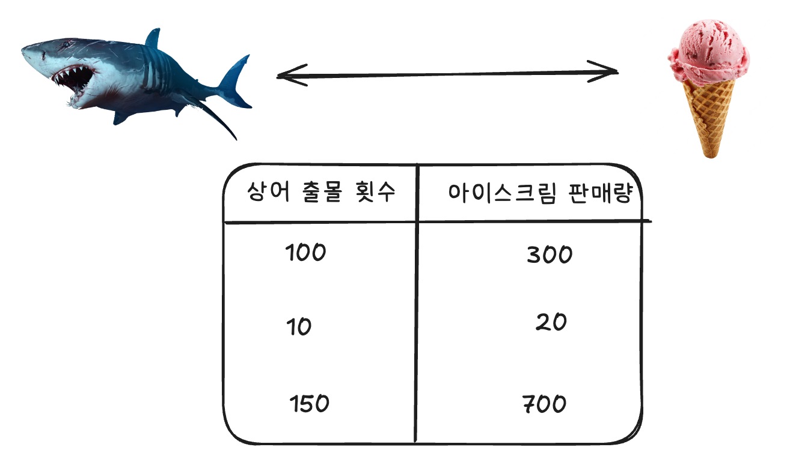

참고자료
- 1: [A Survey on Causal Inference for Recommendation](https://arxiv.org/pdf/2303.11666)

---

# 1. 상관관계에 기반해 패턴을 찾는 ML 모델의 한계

인과추론(causal inference)와 예측(prediction)은 목적이 다릅니다.

<figure>

<figcaption>그림1. 인과추론과 예측의 목적 차이 (출처 : Korea Summer Workshop on Causal Inference 2022)</figcaption>
</figure>

원하는 결과를 얻기 위해 Input을 조절하기 위해서는 "인과추론"이 적절할 것이고,
Output을 정확하게 아는 것이 목표라면 "예측"이 더 적절할 것입니다.

기존의 예측 모델로 적절한 Input을 찾는게 왜 어려운지 이해해보겠습니다.

## 상관관계에 기반한 예측 모델의 한계점

예측 모델은 "상관관계"에 기반해 예측을 수행합니다. 즉 모델이 찾는 패턴은 "상관관계 (correlation)" 입니다. 
이는 원인과 결과의 관계를 나타내는 "인과관계 (causality)"와 구분됩니다.

$$
\text{인과관계} \subset \text{상관관계}
$$

인과관계는 상관관계에 포함됩니다. 즉 모델이 찾은 상관관계 중 일부분은 인과관계가 될 수 있습니다.
다만 데이터에 "편향 (bias)"가 존재할 때 모델은 인과관계를 찾기 어렵습니다.
모델이 찾은 상관관계에 기반해 Input을 바꾸는 "선택"한다면 잘못된 결과를 가져올 수 있습니다.

예시를 통해 이를 알아보겠습니다.

## 상어 빈도 횟수와 매출 간의 관계

<figure>

<figcaption>그림2. 상어 출몰 횟수와 아이스크림 매출</figcaption>
</figure>

상어 출몰 횟수와 아이스크림 매출 데이터가 있다면, 상어 출몰 횟수와 아이스크림의 상관관계를 바탕으로 모델은 패턴을 찾아낼 것입니다.
직관적으로 알 수 있듯, 이는 인과관계가 아닙니다. 상어의 출몰 횟수가 아이스크림의 판매량을 결정하지 않습니다.

<figure>

<figcaption>그림3. 상어 출몰 횟수와 아이스크림 매출, 온도 변수</figcaption>
</figure>

상어의 출몰 횟수와 아이스크림의 매출에 모두 영향을 주는 "온도"라는 변수가 빠져있기 때문에 발생한 문제였습니다.
온도를 통해 상어와 아이스크림 매출 간의 상관관계가 생성된 것입니다.

이 예시를 통해 말하고자 하는 건, 인과관계가 없어도 상관관계가 발생할 수 있고, 이를 통해 예측하는 모델의 결과를 인과관계로 오해하면 안된다는 것입니다.

## 가격과 매출 간의 관계

<figure>

<figcaption>그림4. 가격과 매출</figcaption>
</figure>

그림4와 같은 데이터가 있다고 합시다.
가격과 매출 간의 상관관계가 보입니다. 모델을 학습시키면 이 상관관계를 바탕으로 학습을 할 것입니다.
그렇다면 매출을 올리기 위해서 가격을 올리면 되는 것일까요?

<figure>

<figcaption>그림5. 가격과 매출</figcaption>
</figure>

가격이 매출에 미치는 영향을 파악하기 위해서는 그림3과 같이 변수 간에 상관관계를 형성하는 변수를 찾아야 합니다.

가격이 매출에 미치는 영향을 파악하기 위해서는 성수기/비수기 여부가 같은 상황에서 가격과 매출을 비교해보면 됩니다.
단순하게 생각해서, 성수기일 때 가격이 100일 때보다 500일 떄 매출이 더 높으니, 가격을 높이는게 괜찮다고 생각할 수 있습니다.
하지만 비수기일 때는 비교대상이 없다보니 가격의 영향력을 알 수 없습니다.

2개의 예제를 통해 말하고자 하는 부분은 2가지입니다.
1. 상관관계가 인과관계를 의미하지 않는다. 
2. 상관관계에 기반한 선택이 문제가 될 수 있다.

---

# 2. 인과추론의 목적

인과추론의 목적은 원하는 결과를 얻기 위해 입력변수를 어떻게 바꿔야할지 알아내는 것입니다.
여기서 바꾸는 입력값, 조작 변수를 "처치"라고 칭합니다. 그림 4에서는 가격이 처치가 될 것입니다.
즉 인과추론은 최적의 처치를 찾기 위한 방법론입니다.

이를 위해 처치가 결과에 미치는 "처치효과"를 추정하게 됩니다.
처치효과를 추정할 때 데이터에 편향이 존재하면 이를 잘못 구하게 됩니다.

처치효과는 "처치를 한 후의 값" 과 "처치를 하기 전의 값"을 빼서 구할 수 있습니다.

$$
\text{처치효과} = E[Y|T=1] - E[Y|T=0]
$$

여기서:
- $T=1$: 처치를 받은 그룹 (treatment group)
- $T=0$: 처치를 받지 않은 그룹 (control group)
- $Y$: 결과 변수 (outcome variable)

그림5의 예시를 보면, 가격을 높인 그룹과 가격을 낮춘 그룹의 차이를 통해, 가격을 높였을 때의 효과를 추정할 수 있습니다.
하지만 "성수기/비수기" 여부를 보면 결과에 영향을 미친게 가격 때문만은 아님을 알 수 있습니다.
즉 진짜 가격의 처치효과를 추정하기 위해서는, "성수기"일때 가격을 높인 것과 낮은 것을 빼야할 것입니다.

이는 "통제집단"과 "종속집단"을 통해 가설을 검증하는 과정과 같은 개념입니다.
- 통제집단 (Control Group): 실험에서 독립변수의 영향을 받지 않는 비교 기준이 되는 집단
- 종속집단 (Treatment Group): 실험에서 독립변수의 영향을 받는 집단

실험을 진행할 때 가장 중요한 부분은, 독립변수를 제외한 다른 변수는 완전히 같아야한다는 점입니다.
그렇지 않으면 독립변수 (처치)의 영향을 정확히 파악할 수 없을 것입니다.

**음식 배달 앱 실험 예시 :**
- 잘못된 실험 설계:
    - 실험집단: 비 오는 날 새로운 할인 정책 적용
    - 통제집단: 맑은 날 기존 정책 적용
- 문제점: 날씨 조건이 다름
    - 비 오는 날: 집에서 주문하는 경향 증가
    - 맑은 날: 외식 선호
- 결과: 할인 정책 효과인지, 날씨 효과인지 구분 불가

## RCT(Randomized Control Trial)

다른 변수들을 통제하기 가장 좋은 방법은 참가자들을 실험집단과 통제집단에 완전히 무작위로 배정하는 것입니다. 
이를 통해 두 집단 간의 차이를 최소화할 수 있습니다.

하지만 무작위 배정 실험이 불가능한 경우도 있고, 무작위 배정을 하더라도 편향이 발생할 수 있습니다.

## RCT를 해도 편향이 생기는 경우

RCT를 진행하더라도 통제집단과 종속집단 간의 차이가 발생할 수 있습니다.

제가 생각하는 가장 대표적인 예시는 "여론 조사"입니다.
무작위로 여론조사 대상을 선정하고 이를 통해 전체 여론에 대해 추정할 수 있습니다.

하지만 여론조사는 RCT의 한계를 보여주는 가장 대표적인 예시입니다. 
이론적으로는 전화번호부에서 완전 무작위로 대상을 선정하여 전체 여론을 추정할 수 있다고 하지만, 실제로는 여러 가지 문제가 발생합니다.

가장 큰 문제는 "응답률 편향"입니다. 무작위로 선정했다고 해도 모든 사람이 동일하게 응답하지 않습니다. 바쁜 직장인이나 외출 중인 사람들은 전화를 받지 못하고, 전화를 받더라도 낯선 번호라면 무시하는 경우가 많습니다. 또한 응답한다고 해도 솔직하게 답하지 않는 경우도 있습니다.

특히 정치적 관심도에 따른 차이가 두드러집니다. 정치에 관심이 많거나 특정 정당을 지지하는 사람들이 여론조사에 더 적극적으로 응답하는 반면, 정치에 무관심하거나 중도 성향을 가진 사람들은 상대적으로 응답하지 않는 경향이 있습니다. 연령대별로도 차이가 있어서, 50대 이상의 사람들은 전화 사용에 익숙하고 시간적 여유가 있어 응답률이 높은 반면, 20-30대는 스마트폰을 주로 사용하고 전화를 거부하는 경향이 있어 응답률이 낮습니다.

실제 사례로는 2016년 미국 대선에서 여론조사가 힐러리 클린턴의 승리를 예측했지만 실제로는 도널드 트럼프가 승리한 경우가 있습니다. 이는 교육 수준이 낮은 백인 노동자층의 응답률이 낮았기 때문입니다. 한국에서도 대선 여론조사의 전화 응답률이 10-20% 수준에 머물러 있고, 응답자들이 정치에 관심이 많은 계층을 과대 대표하게 되어 실제 여론과 차이를 보이는 경우가 많습니다.

이러한 문제를 해결하기 위해 다중 모드 조사를 병행하거나, 연령과 성별, 지역별로 균등하게 표본을 추출하는 층화 표본 추출 방법을 사용하기도 합니다. 또한 응답자와 비응답자 간의 특성 차이를 분석하여 편향 정도를 정량적으로 측정하는 노력도 이루어지고 있습니다.

여론조사는 이론적으로는 무작위 표본 추출을 지향하지만, 실제로는 다양한 편향이 발생하여 RCT의 이상적인 조건을 만족하지 못하는 대표적인 사례입니다. RCT에서는 실험자가 직접 개입하여 무작위 배정을 하고 처치 효과를 명확하게 측정할 수 있지만, 여론조사에서는 완전한 무작위 배정이 불가능하고 응답 여부가 사용자의 선택에 의존하며, 시간이나 상황과 같은 외부 요인의 영향을 받게 됩니다.

## RCT를 할 수 없는 경우

RCT 자체를 진행할 수 없는 경우도 있습니다.

가장 대표적인 것은 윤리적 문제로 인한 제한입니다. 예를 들어, 새로운 암 치료 약물의 효과를 테스트하려고 할 때 통제집단에 위약을 주는 것은 생명에 위험할 수 있어 윤리적으로 문제가 됩니다. 이런 경우에는 RCT를 진행할 수 없고 관찰 연구나 다른 방법을 사용해야 합니다.

교육 분야에서도 비슷한 문제가 발생합니다. 새로운 교육 방법의 효과를 테스트하려고 할 때, 통제집단 학생들에게 열등한 교육을 제공하는 것은 교육 기회의 불평등을 야기할 수 있어 부당합니다. 특정 학생들만 새로운 수업 방식을 배제하는 것은 윤리적으로 문제가 되므로 RCT 대신 자연 실험이나 준실험을 사용하게 됩니다.

실용적 제약으로 인한 경우도 있습니다. 회사 전체에 새로운 인사 정책을 적용하려고 할 때, 일부 직원에게만 적용하고 나머지는 기존 정책을 유지하는 것이 불가능한 경우가 많습니다. 급여 체계나 근무 시간 정책 같은 것들은 전체 조직에 동시에 적용해야 하므로 RCT를 통한 비교가 어렵습니다. 이런 경우에는 Before-After 비교나 다른 회사와의 비교 연구를 통해 효과를 측정하게 됩니다.

자연재해의 영향을 연구하려는 경우에도 RCT는 불가능합니다. 지진이나 홍수 같은 자연재해를 인위적으로 발생시켜서 특정 지역에만 적용하고 통제집단과 비교하는 것은 불가능하기 때문입니다. 이런 경우에는 자연 실험을 활용하여 비슷한 조건의 지역들을 비교하는 방법을 사용합니다.

## 인과추론에서 하려는 것

인과추론의 목적은 "처치효과"를 추정하는 것입니다.
이를 위해서는 통제집단과 종속집단이 잘 설정되어 있어야 합니다.
가장 이상적인 조건은 RCT가 잘 진행된 상태입니다. 하지만 RCT의 한계도 있고, RCT를 할 수 없는 상황들도 있습니다.
이런 상황에서는 통제집단과 종속집단의 차이, 즉 편향이 발생하게 됩니다. 그리고 이는 잘못된 처치효과 추정으로 이어집니다.

인과추론에서는 이러한 편향을 파악하고 제거해 처치효과를 추정해나가는 것을 목표로 하고 있습니다.
이상적인 RCT 형태로 만들어 온전한 처치효과를 추정하려고 합니다.

---

# 3. 추천시스템과 인과추론

추천시스템의 목표를 생각해보면 좋을 것 같습니다.
1. 사용자가 가장 만족하고 선택할 수 있는 리스트를 제공하는 것
2. 사용자가 만족하고 선택할 결과를 정확하게 예측하는 것

앞서 언급한 것처럼 목표가 첫 번째라면 인과관계를 추론하고 이를 통해 최적의 Input을 찾아나가는 인과추론 방법이 적절할 것이고, 두 번째라면 예측 결과를 정확하게 예측할 수 있는 예측 모델이 적절할 것입니다.

첫 번째 목표를 달성하려고 한다면 기존의 추천시스템에는 한계가 있습니다. 
앞서 언급한 것처럼 상관관계에 기반하여 패턴을 찾는 예측 모델로는 어떤 리스트를 보여주는 것이 최선의 결과를 얻을 수 있을지 판단하기 어렵습니다. 또한 이는 데이터에 존재하는 편향에 기반하고 있습니다.

## 기존 추천시스템의 한계

어떤 사용자가 특정 아이템을 클릭하거나 사용했다면, 해당 사용자는 그 아이템을 선호한다고 판단하는 것이 일반적입니다. 하지만 실제로는 사용자가 개인적인 취향 때문에 선택한 것이 아니라, 단순히 인기도가 높아서 선택했을 가능성이 큽니다.

예를 들어, 음악 추천에서 특정 곡이 차트 상위에 올라있다면, 사용자들은 실제로 그 곡을 좋아해서가 아니라 "많은 사람들이 듣고 있으니 한번 들어보자"는 심리로 선택할 수 있습니다. 마찬가지로 쇼핑몰에서 베스트셀러 상품을 선택하는 경우도, 개인적인 선호도보다는 "인기 있는 제품이니 좋을 것이다"라는 믿음에 기반한 선택일 수 있습니다.

이러한 현상은 추천시스템이 사용자의 진정한 선호도를 파악하는 데 어려움을 겪게 만듭니다. 
단순히 클릭이나 구매 기록만으로는 사용자가 실제로 얼마나 만족했는지, 다른 아이템을 보여줬다면 더 만족했을지에 대한 답을 얻기 어렵습니다.

---

# 4. Causal Recommendation (참고 1 정리)

<figure>

<figcaption>그림6. causal inference를 적용했을 때의 장점</figcaption>
</figure>

인과적 추천시스템이 전통적인 접근 방식을 능가할 수 있는 이유는 크게 두 가지 핵심 강점 때문입니다.

**첫 번째는 인과관계를 모델링할 수 있다는 점입니다. :**
현재 대부분의 ML은 변수 간의 상관관계에 기반해 패턴을 찾습니다. 
하지만 실제 상황에서는 상관관계보다 인과관계가 더 중요하며, 상관관계로는 잘못된 선택을 할 수 있습니다.

<figure>

<figcaption>그림7. 과거 기록으로 취향을 추정할 때 생길 수 있는 문제</figcaption>
</figure>

예를 들어, 영화 추천 플랫폼에서 여성 사용자가 액션 영화를 시청했다고 해서 그녀가 액션 영화를 좋아한다고 결론짓고 관련 액션 영화를 많이 추천할 수 있습니다. 하지만 실제로는 사용자가 개인적인 선호도 때문이 아니라 단순히 인기도 때문에 그 영화를 봤을 가능성이 큽니다. 전통적인 추천시스템이 학습한 사용자 관심사와 영화 장르 간의 허위 상관관계(spurious correlation)는 사용자 경험을 저하시킬 수 있습니다. 

<figure>

<figcaption>그림8. 인과효과를 추정하는 경우</figcaption>
</figure>

반면 인과적 추천시스템은 사용자의 개별적 관심사와 순응성(conformity)의 인과적 효과를 각각 학습할 수 있어서, 나중에 액션 영화를 잘못 추천하는 것을 방지할 수 있습니다.

**두 번째는 반사실 질문에 답할 수 있다는 점입니다. :** 
<small>* 반사실 질문(counterfactual question)은 "만약 ~했다면 어떻게 되었을까?"라는 가정적 상황을 다루는 질문입니다.</small>

많은 추천시스템 문제들, 즉 데이터 증강(data augmentation), 분포 외 일반화(out-of-distribution generalization), 정책 평가(policy evaluation) 등은 본질적으로 반사실적 문제입니다. 이는 일부 인과 변수들의 값이 현실과 다른 상황을 의미합니다. 데이터 증강 문제의 경우, 관찰된 데이터의 중요한 보완 자원으로서 반사실적 데이터는 "추천된 아이템이 달랐다면 사용자의 상호작용은 어떠했을까?" 또는 "이전에 추천받지 못한 사용자에게 아이템을 추천했다면 클릭 확률은 어떠했을까?"와 같은 질문에 답해야 합니다. 분포 외 일반화 문제는 훈련 기간과 테스트 기간 간의 상호작용이 독립적이고 동일하게 분포한다는 IID(Independent and Identically Distributed) 가정을 위반하는 추천을 의미합니다. 전통적인 추천은 사용자와 아이템 간의 허위 연관관계를 학습할 수 있지만, 인과적 추천시스템은 반사실적 수단을 통해 추천 작업에서 불변하거나 변경되지 않는 변수나 인과관계를 찾아내고, 분포가 변경될 때 이를 재사용하여 일반화할 수 있습니다.

또한 정책 평가나 업리프트 모델링(uplift modeling)에서도 반사실적 접근이 중요합니다. 업리프트 모델링은 추천으로 인한 사용자 상호작용의 증가를 추정하는데, 이는 한 아이템에 대해 두 가지 상호 배타적인 결과(특정 사용자에게 아이템 i를 추천하거나 추천하지 않는 것) 간의 차이를 추정해야 하기 때문에 반사실적 문제입니다.

---

<figure>

<figcaption>그림8. 추천에 사용되는 causal inference 방법론들</figcaption>
</figure>

## PO-based Methods

PO-based Methods는 **Potential Outcome Framework**를 기반으로 한 방법들을 의미합니다.

Potential Outcome Framework는 인과추론의 핵심 개념 중 하나로, 각 개체(사용자)가 처치를 받았을 때와 받지 않았을 때의 잠재적 결과를 비교하는 접근 방식입니다.

추천시스템에서의 예시로는:
- **처치를 받은 경우**: 사용자 A에게 아이템 X를 추천했을 때의 결과 (클릭 여부, 구매 여부 등)
- **처치를 받지 않은 경우**: 사용자 A에게 아이템 X를 추천하지 않았을 때의 결과

이 두 잠재적 결과의 차이를 통해 추천의 실제 인과 효과를 측정할 수 있습니다. PO-based Methods는 이러한 잠재적 결과를 모델링하고 추정하는 다양한 기법들을 포함합니다.

### Propensity Score Strategy

Propensity Score Strategy는 처치 할당의 확률을 모델링하여 선택 편향을 조정하는 방법입니다. 사용자가 특정 아이템을 추천받을 확률을 추정하고, 이를 가중치로 사용하여 인과 효과를 추정합니다. 이 방법은 관찰 데이터에서 RCT와 유사한 조건을 만들어내어 인과관계 추론을 가능하게 합니다.

### Causal Effect Strategy

Causal Effect Strategy는 직접적으로 인과 효과를 모델링하는 접근 방식입니다. 사용자-아이템 상호작용의 인과 구조를 파악하고, 처치(추천)가 결과(클릭, 구매 등)에 미치는 직접적인 영향을 추정합니다. 이를 통해 추천의 실제 효과를 정확하게 측정할 수 있습니다.

## SCM-based Methods

SCM-based Methods는 **Structural Causal Model**을 기반으로 한 방법들을 의미합니다.

Structural Causal Model은 변수들 간의 인과 관계를 방향성 그래프(directed graph)로 표현하는 모델입니다. 각 변수는 다른 변수에 영향을 미치거나 영향을 받는 구조적 관계를 가지며, 이를 통해 복잡한 인과 구조를 시각화하고 분석할 수 있습니다.

추천시스템에서 SCM은:
- **사용자 특성** → **추천 결과** → **사용자 행동**
- **아이템 특성** → **추천 결과** → **사용자 행동**
- **사용자 선호도** → **추천 결과** → **사용자 만족도**

와 같은 인과 관계를 모델링합니다.

SCM의 장점은 변수들 간의 관계를 명확하게 파악하고, 혼동 요인(confounder), 중재 변수(mediator), 결과 변수(collider) 등의 구조를 이해하여 정확한 인과 효과를 추정할 수 있다는 점입니다. 이를 통해 추천시스템의 편향을 제거하고 더 정확한 추천을 제공할 수 있습니다.

### Model with Collider Structure

Collider Structure를 가진 모델은 두 변수가 공통 결과에 영향을 미치는 구조를 다룹니다. 추천시스템에서는 사용자 특성과 아이템 특성이 모두 상호작용 결과에 영향을 미치는 경우를 의미합니다. 이 구조를 올바르게 모델링하여 편향을 방지하고 정확한 인과 효과를 추정할 수 있습니다.

### Model with Mediator Structure

Mediator Structure는 처치가 중간 변수를 통해 결과에 영향을 미치는 구조입니다. 예를 들어, 추천이 사용자의 관심도를 높이고, 이 관심도가 최종 구매 결정에 영향을 미치는 경우입니다. 이 구조를 통해 추천의 직접적 효과와 간접적 효과를 구분하여 분석할 수 있습니다

### Model with Confounder Structure

Confounder Structure는 처치와 결과 모두에 영향을 미치는 공통 원인 변수를 다루는 구조입니다. 추천시스템에서는 사용자의 과거 행동이나 선호도가 현재 추천과 상호작용 결과 모두에 영향을 미치는 경우입니다. 이 구조를 제대로 모델링하여 혼동 요인을 통제하고 인과 관계를 명확히 할 수 있습니다.

## General Counterfactuals-based Methods

General Counterfactuals-based Methods는 **일반적인 반사실적 방법들**을 의미합니다.

Counterfactual(반사실적)은 "만약 ~했다면 어떻게 되었을까?"라는 가정적 상황을 다루는 개념입니다. 이 방법들은 추천시스템에서 실제로 일어나지 않은 상황에 대해 "만약 그랬다면"이라는 가정 하에 결과를 추정하는 기법들을 포함합니다.

추천시스템에서의 구체적인 예시:
- **데이터 증강**: "만약 사용자에게 다른 아이템을 추천했다면 클릭했을까?"
- **도메인 적응**: "만약 다른 환경에서 이 추천을 했다면 어떻게 되었을까?"
- **공정성**: "만약 사용자의 민감한 특성이 달랐다면 추천이 어떻게 달라졌을까?"
- **설명 가능성**: "어떤 요인이 이 추천 결과를 만들었을까?"

이러한 반사실적 접근을 통해 추천시스템의 인과관계를 더 정확하게 파악하고, 다양한 시나리오에 대한 예측과 분석이 가능해집니다.

### Strategy for Domain Adaptation

Domain Adaptation 전략은 한 도메인에서 학습된 모델을 다른 도메인에 적용할 때 사용됩니다. 반사실적 접근을 통해 도메인 간 불변하는 인과 관계를 찾아내고, 이를 새로운 환경에서 활용하여 추천 성능을 향상시킵니다.

### Strategy for Data Augmentation

Data Augmentation 전략은 관찰되지 않은 사용자-아이템 상호작용을 생성하는 방법입니다. "만약 다른 아이템을 추천했다면 어떻게 되었을까?"라는 반사실적 질문에 답하여 가상의 상호작용 데이터를 생성하고, 이를 통해 모델의 학습을 보강합니다.

### Strategy for Fairness and Explanation

Fairness와 Explanation 전략은 추천시스템의 공정성과 설명 가능성을 향상시키는 방법입니다. 반사실적 분석을 통해 민감한 특성의 영향을 제거하고, 실제 세계와 반사실적 세계를 비교하여 추천 결과에 영향을 미치는 사용자 상호작용을 찾아내어 설명 가능한 추천을 제공합니다.