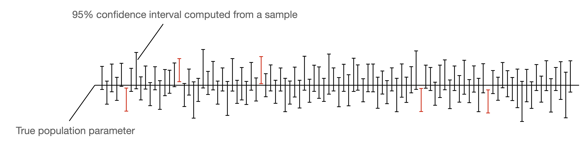

참고자료
- 1: [Confidence Intervals for Machine Learning](https://www.geeksforgeeks.org/machine-learning/confidence-intervals-for-machine-learning/)
- 2: [Don’t Forget Confidence Intervals for Your ML Product](https://towardsdatascience.com/dont-forget-confidence-intervals-for-your-ml-product-272009bfab56/)
- 3: [Creating Confidence Intervals for Machine Learning Classifiers](https://sebastianraschka.com/blog/2022/confidence-intervals-for-ml.html)
- 4: [Confidence vs Prediction Intervals: Understanding the Difference](https://www.datacamp.com/blog/confidence-intervals-vs-prediction-intervals)

---

# 신뢰구간의 정의

> A confidence interval provides a range of values within which a population parameter is likely to fall, with a certain level of confidence.

신뢰구간은 모집단의 모수(parameter)가 특정 범위 내에 있을 가능성을 나타내는 통계적 구간

---

# metric에 대한 신뢰구간 (참고1)

보통 ML의 신뢰구간은 metric에 대한 신뢰구간을 의미하는 것 같다.

<figure>
    
    <figcaption>그림1. confidence_interval_for_ML (참고1)</figcaption>
</figure>

> For example, a 95% confidence interval of [85%, 90%] for model accuracy means that if we repeated the process multiple times, about 95% of the intervals would contain the true accuracy. This helps in assess model reliability and make informed decisions.

정확도와 같은 평가지표를 신뢰구간으로 제시하면 데이터가 바뀌었을 때에 대한 고려도 할 수 있고, 이러한 이유 떄문에 선택에 더 도움이 됨.

---

# 신뢰구간의 중요성 (참고1)

신뢰구간은 머신러닝의 다양한 영역에서 가치 있는 정보를 제공합니다:

1. 모델 성능 평가
- 정확도나 F1-score와 같은 단일 지표에만 의존하는 대신, 신뢰구간은 서로 다른 샘플에서의 성능 변화를 이해하는 데 도움을 줍니다.
- **예시**: 모델의 정확도가 85%이고 95% 신뢰구간이 [82%, 88%]라면, 새로운 데이터에서 테스트할 때 모델의 정확도가 이 범위 내에서 변동할 수 있음을 의미합니다.

2. 회귀 계수 해석
- 선형 회귀 모델에서 신뢰구간은 추정된 계수의 신뢰성을 평가하는 데 도움을 줍니다.
- **예시**: 특정 특성의 계수가 2.5이고 95% 신뢰구간이 [1.8, 3.2]라면, 해당 특성이 양의 효과를 가진다고 합리적으로 확신할 수 있습니다.

3. 예측의 불확실성
- 신뢰구간은 모델 예측에 대한 불확실성 측정을 제공하며, 특히 확률적 모델에서 유용합니다.
- **예시**: 주택 가격을 [200K, 250K] 범위로 95% 신뢰수준에서 예측한다면, 실제 가격이 이 범위 내에 있을 가능성이 높음을 의미합니다.

4. A/B 테스트 및 가설 검정
- 두 모델이나 특성을 비교할 때, 신뢰구간은 차이가 통계적으로 유의한지 판단하는 데 도움을 줍니다.
- **예시**: 모델 A의 정확도가 90% [88%, 92%]이고 모델 B가 87% [85%, 89%]라면, 모델 A가 우수하다는 증거가 있습니다.

---

# 신뢰구간을 구하는 법 (참고2)

> So how can we create and add confidence intervals to our models? As the name implies, to build confidence intervals (or any other measure of confidence) you first need to define what your metric represents and what confidence means to you and your user. 
> There are many ways to derive a measure of confidence but all depend on some sort of knowledge which you can use to validate and test your predictions.

---

# 신뢰구간을 구하는 법 (참고3)

> Confidence intervals are no silver bullet, but at the very least, they can offer an additional glimpse into the uncertainty of the reported accuracy and performance of a model.

여러 글에서 신뢰구간을 제시하는게 소통을 하는데 도움을 준다고 이야기하네.
공감이 된다. 어떤 추정값을 이야기할 때 불확실성에 대한 이야기는 꼭 포함이 되어야 한다고 생각한다.

<figure>
    
    <figcaption>그림2. with_CI_without_CI</figcaption>
</figure>

확실히 포함된게 더 보기 좋음

이 블로그에서 CI를 구하는 다양한 방법들을 소개하고 있다. 기본적인 컨셉만 이해하고, 정리하다가 너무 많아서 패스.

## Confidence Intervals in a Nutshell

> A confidence interval is a method that computes an upper and a lower bound around an estimated value. The actual parameter value is either insider or outside these bounds.

추정값에 대한 불확실성을 정량화한게 신뢰구간이라고 생각해볼 수 있겠다.

<figure>
    
    <figcaption>그림3. 95% 신뢰구간의 의미</figcaption>
</figure>

95% 신뢰구간의 의미는?

> “95% 신뢰구간”이란, 동일한 방법으로 표본을 여러 번 뽑아서 신뢰구간을 계속 계산한다면, 그중 약 95%의 신뢰구간이 모집단의 참값을 포함하게 된다는 의미

오해와 정확한 해석

> 많은 사람들이 “이 신뢰구간 안에 진짜 평균이 95% 확률로 들어 있다”라고 생각하지만, 엄밀하게는 틀린 해석이야. 참값은 이미 고정된 값이니까, 확률로 해석하지 않아. 올바른 해석은 “이 방식으로 구한 신뢰구간이 모집단의 평균을 95% 수준으로 포함한다”는 것.

원하는 건 모델의 성능에 대한 값들.
신뢰구간은 위에서 언급한 것처럼 모델이 추정값에 대한 얼만큼의 불확실성을 가지고 있는지를 의미.

## A Note About Statistical Significance

통계적 유의성이란?

> 통계적 유의성은 관찰된 결과가 단순한 우연이나 확률적 변동이 아닌, 실제로 의미 있는 차이나 관계가 있다고 판단할 수 있는 정도를 나타냅니다.

<figure>
    
    <figcaption>그림4. 신뢰구간의 중복을 통한 판단</figcaption>
</figure>

group1과 group2가 다른지를 신뢰구간을 통해 확인해볼 수 있다.
당연하게도 완전히 겹치지 않으면 확실히 다른 것이라고 판단할 수 있다.
겹친다면 겹친 분포를 그리고 여기서 mu = 0이 신뢰구간에 포함되는지를 통해 확인할 수 있다.

## Method 1 : Normal Approximation Interval Based on a Test Set

> In our case, the sample mean $\bar x$ is test set accuracy $\text{ACC}_{test}$, a proportion of success (in the context of a Binomial proportion confidence interval).

### Binomial proportion confidence interval?

> 성공/실패와 같은 이항 분포를 따르는 비율(proportion)에 대한 신뢰구간

ML에서의 적용:
- 분류 모델의 정확도(accuracy)는 이항 분포를 따름
- 각 예측이 맞음(성공) 또는 틀림(실패)의 두 가지 결과만 가짐
- 전체 예측 중 맞은 비율이 정확도

예시:
- 테스트셋에서 100개 샘플 중 85개를 맞췄다면
- 정확도 = 85/100 = 0.85 (85%)
- 이 85%라는 비율에 대한 신뢰구간을 구하는 것이 이항 비율 신뢰구간

계산 방법:
- 정규근사법 (Normal Approximation)
- Wilson 방법
- Clopper-Pearson 방법

### 수식 정의

standard error : $\sqrt{\frac{1}{n} \text{ACC}_{test} (1 - \text{ACC}_{test})}$

> You can find a description of this method in section 1.7 Confidence Intervals via Normal Approximation of my “[Model Evaluation, Model Selection, and Algorithm Selection in Machine Learning”](https://arxiv.org/pdf/1811.12808).

<figure>
    
    <figcaption>그림5. 정확도에 대한 신뢰구간 표시</figcaption>
</figure>

## Method 2: Bootstrapping Training Set - Setup Step

> If we only have one estimate, like the accuracy from a single test set, we need to make assumptions about the distribution of this accuracy value.
> For example, we may assume that the accuracy values (that we would compute from different samples) are normally distributed.

부트스트랩 기반으로 신뢰구간을 구한다는건 정규분포를 가정하는건가?

> No! 부트스트랩은 정규분포 가정 없이도 신뢰구간을 구할 수 있는 강력한 비모수적 방법입니다. 이것이 바로 부트스트랩의 가장 큰 장점 중 하나입니다.

# Confidence vs Prediction Intervals: Understanding the Difference (참고4)

> The root cause of this uncertainty is the sampling process. 
> It is unrealistic to consider the entire population when conducting a statistical analysis.

좋은 문장이다.

> The true value of the population parameter is usually not exactly equal to the value estimated from the sample - this difference is the standard error.
> To account for this error, it is conventional to estimate an expected value and then specify a range that is expected to contain the actual value.

추정값은 실제값과 차이가 있을 것이고, 이를 범위로 표시한다.

## What is a Prediction Interval?

> A prediction interval is the range that is expected - with some level of confidence, to contain the true value of an individual data point, based on a prediction made using regression analysis. 

내가 원하는 개념이 prediction interval이구나. 개별 추정값에 대한 오차 범위.

> However, you must account for the increased variability of individual data points because you are predicting an individual value (and not an average). 
> Thus, the prediction interval is larger than the confidence interval. 

