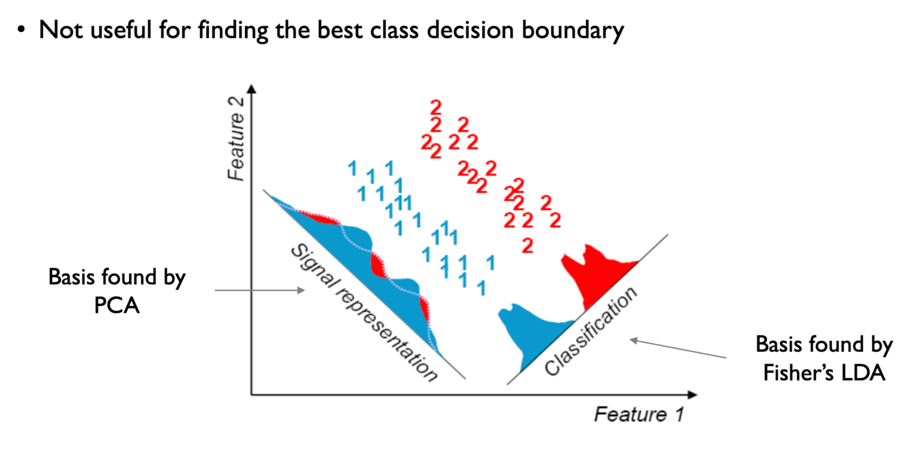
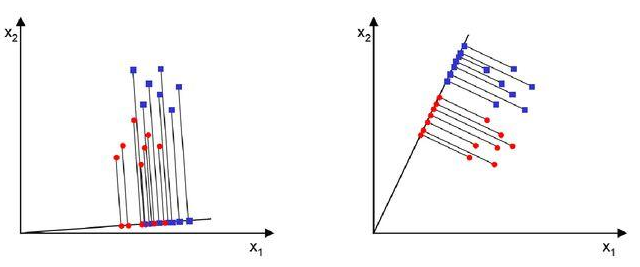

참고자료
- 1: [ratsgo](https://ratsgo.github.io/machine%20learning/2017/03/21/LDA/)

---

차원 축소 방법 중 하나.
차원 축소의 목적은 정보의 양을 최대한 보존하면서 축을 줄이는 것.
LDA에서는 정보의 양을 클래스끼리 구분되는 정도를 정보의 양이라고 정의하고 있다.

PCA에서는 "분산"을 정보의 양이라고 정의.

<figure>

<figcaption>그림1. LDA vs PCA</figcaption>
</figure>

LDA에서는 클래스 간의 구분이 최대가 되는 축을 찾는 것을 목표로 함.

<figure>

<figcaption>그림2. LDA 예시 그림</figcaption>
</figure>

클래스 간의 구분이 최대가 된다, 는 말을 어떻게 정의할 수 있을까?

<figure>

<figcaption>그림3. LDA 예시 그림</figcaption>
</figure>

> 참고 1.
> 그렇다면 두 범주를 잘 구분할 수 있는 직선은 어떤 성질을 지녀야 할까요? 
> 사영 후 두 범주의 중심(평균)이 서로 멀도록, 그 분산이 작도록 해야할 겁니다. 
> 왼쪽 그림을 오른쪽과 비교해서 보면 왼쪽 그림은 사영 후 두 범주 중심이 가깝고, 분산은 커서 데이터가 서로 잘 분류가 안되고 있는 걸 볼 수가 있습니다. 
> 반대로 오른쪽 그림은 사영 후 두 범주 중심이 멀고, 분산은 작아서 분류가 비교적 잘 되고 있죠. LDA는 바로 이런 직선을 찾도록 해줍니다.

두 범주의 중심이 서로 멀고, 분산이 작도로.


## 이론적 내용

### LDA의 목표

LDA(Linear Discriminant Analysis)는 클래스 간의 분산을 최대화하고 클래스 내 분산을 최소화하는 선형 변환을 찾는 것이 목표입니다. 이를 통해 클래스들을 가장 잘 구분할 수 있는 새로운 축을 찾습니다.

### 수학적 정의

데이터가 $n$개의 샘플과 $p$개의 특성을 가진다고 할 때, LDA는 다음과 같이 정의됩니다:

**클래스 간 분산 행렬 (Between-class scatter matrix):**
$$
S_B = \sum_{i=1}^{c} n_i (\mu_i - \mu)(\mu_i - \mu)^T
$$

**클래스 내 분산 행렬 (Within-class scatter matrix):**
$$
S_W = \sum_{i=1}^{c} \sum_{x \in C_i} (x - \mu_i)(x - \mu_i)^T
$$

여기서:
- $c$: 클래스의 개수
- $n_i$: $i$번째 클래스의 샘플 수
- $\mu_i$: $i$번째 클래스의 평균 벡터
- $\mu$: 전체 데이터의 평균 벡터
- $C_i$: $i$번째 클래스의 샘플 집합

### 최적화 문제

LDA는 다음 비율을 최대화하는 벡터 $w$를 찾습니다:

$$
J(w) = \frac{w^T S_B w}{w^T S_W w}
$$

> 클래스끼리의 구분은 커지게 하고, 클래스 내부의 분산은 작게 하도록 목적함수 정의.

이를 해결하기 위해 일반화된 고유값 문제를 풀면 됩니다:

$$
S_B w = \lambda S_W w
$$```


### 해법

최적의 투영 벡터들은 $S_W^{-1} S_B$의 고유벡터들입니다. 고유값이 큰 순서대로 정렬하여 상위 $k$개의 고유벡터를 선택하면 $k$차원으로 축소된 데이터를 얻을 수 있습니다.

### PCA와의 차이점

- **PCA**: 데이터의 분산을 최대화 (비지도 학습)
- **LDA**: 클래스 간 분리도를 최대화 (지도 학습)

LDA는 클래스 레이블 정보를 활용하여 클래스들을 가장 잘 구분할 수 있는 방향으로 데이터를 투영합니다.


