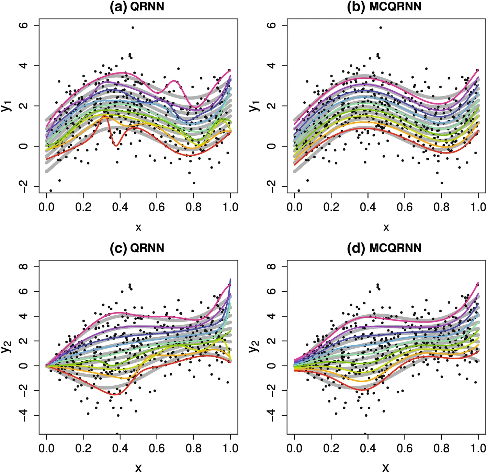
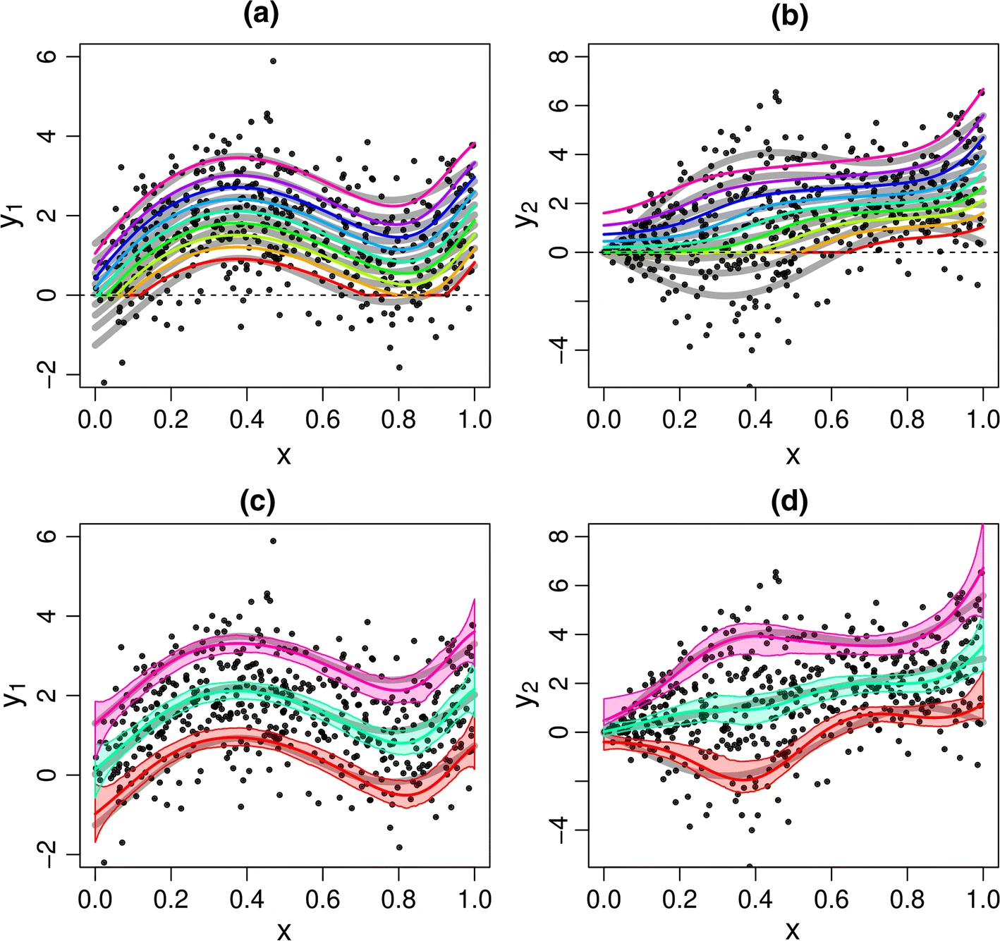
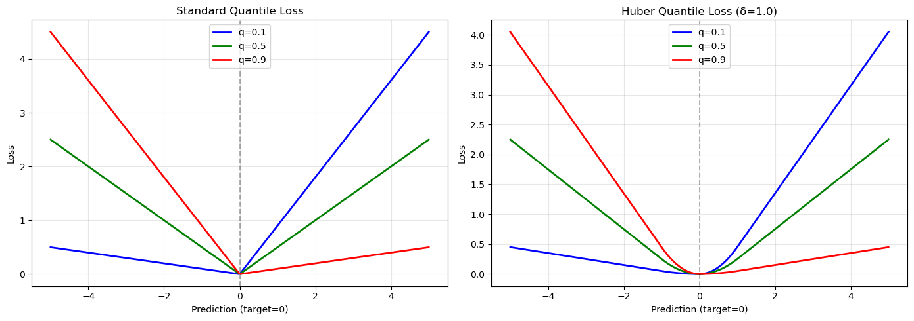

- [paper link](https://link.springer.com/article/10.1007/s00477-018-1573-6)

논문 빠르게 파악하는 연습도 같이

# 개념 요약, 스케치

---

# 1단계. 구조부터 잡는 ‘스켈레톤 리딩’ (5~10분)
> 📍목표: 이 논문이 나랑 관련 있는지 판단

---

## Abstract
- 문제 정의 + 핵심 기여 + 비교 대상이 나오는 부분.
- 여기서 “이 논문이 해결하려는 Pain Point”를 한 문장으로 요약해.

논문에서는 quantile crossing problem을 해결하기 위한 새로운 모델을 제시하고 있다.

> These estimates are prone to “quantile crossing”, where regression predictions for different quantile probabilities do not increase as probability increases.

> As a remedy, this study introduces a novel nonlinear quantile regression model, the monotone composite quantile regression neural network (MCQRNN)
1. simultaneously estimates multiple non-crossing, nonlinear conditional quantile functions
2. allows for optional monotonicity, positivity/non-negativity, and generalized additive model constraints
3. can be adapted to estimate standard least-squares regression and non-crossing expectile regression functions

MCQRNN을 제시. 이에 대한 설명.

>  In comparison to standard QRNN models, the ability of the MCQRNN model to incorporate these constraints, in addition to non-crossing, leads to more robust and realistic estimates of extreme rainfall.

QRNN 모델 대비 실제 문제를 풀기 위한 다양한 조건들도 포함시켜서 학습시킬 수 있다.

---

## Figure
- 모델 구조나 전체 파이프라인을 보여주는 도식이 대부분 핵심 요약임.
- “입력–처리–출력–평가” 흐름을 머릿속에 그려둬.

<figure>
  
  <figcaption>Fig. 1</figcaption>
</figure>
- 그림 설명 정리:
  - (a), (c): 일반 QRNN(Quantile Regression Neural Network) 결과  
  - (b), (d): MCQRNN(Monotone Composite QRNN) 결과  
  - 각 그래프의 검은 점은 synthetic data (Eq. 15: a, b / Eq. 16: c, d)를 의미  
  - 무지개색 곡선들은 아래에서 위로 각각 분위수 s = 0.1, 0.2, ..., 0.9 (총 9개)를 나타냄  
  - 회색 실선: 실제(ground truth) 조건부 분위수 함수  
- 주요 포인트:  
  - MCQRNN은 quantile crossing 없이, 더 부드럽고 현실적인 분위수 곡선을 산출함

MCQRNN이 조금 더 안정적이다. 

<figure>
  
  <figcaption>Fig. 2</figcaption>
</figure>

- Fig. 1b, d와 유사한 실험 결과이지만,  
  - (a) : MCQRNN에 positivity constraint(출력 양수 제약)를 추가함  
  - (b) : positivity + monotonicity constraint(출력 양수 및 단조성 제약) 모두 추가  
- (c), (d) : Fig. 1b, d에서 0.1, 0.5, 0.9-quantile에 대해 parametric bootstrap(500회)로 추정한 95% 신뢰구간(Confidence Interval) 결과 표시  

---

## Conclusion
- 어떤 점을 ‘새롭게 했다’ + ‘향후 과제’로 정리해두는 부분.
- Abstract과 결론을 비교하면 “진짜 얻은 건 뭔가”를 파악 가능.

> MCQRNN is the first neural network-based quantile regression model that guarantees non-crossing of regression quantiles.

> Given its close relationship to composite QR models, MCQRNN is first evaluated using the Monte Carlo simulation experiments adopted by Xu et al. (2017) to demonstrate the CQRNN model

기존 모델보다 robust 하다.

- MCQRNN은 기존 MLP, QRNN, CQRNN 모델 대비 특히 오차 분포가 비정규(non-normal)일 때 더욱 견고하다.
- 캐나다 강우량(IDF 곡선) 데이터에 적용하여 실제 성능을 평가함.
- 다양한 폭풍 지속 시간과 재현기간에 대해 정보를 효과적으로 공유하여 과적합에 강하다(cross-validation result).
- 단조 제약(monotonicity constraint) 적용이 가능하여, 강우 강도가 발생 빈도 및 지속 시간이 작아질수록 자연스럽게 증가하는 실제 특성을 반영할 수 있다.
- 계측소가 없는 지역에서도 극한 강우의 현실적이고 신뢰성 있는 추정이 가능하다.

---

## 1문장 요약 시도
- 예: “이 논문은 기존 GBDT 기반 CTR 예측의 calibration 문제를 NN 기반으로 해결함.”
- 이 한 문장이 안 나오면 → 아직 요약할 수준으로 이해가 안 된 것.

QRNN에 다양한 제약조건을 추가해 모델을 학습시킬 수 있고, 이를 통해 원하는 결과를 얻을 수 있다.

---

# 2단계. ‘구조적 리딩’ — 핵심만 깊게 (20~40분)
> 📍목표: 핵심 아이디어·모델·실험 구조를 빠르게 재구성하기

---

## Introduction
- “왜 이 문제인가?” — 문제의 중요성
- “기존 방법의 한계” — baseline 정리
- “우리의 기여” — bullet point로 세 줄 정리

to provide estimates of predictive uncertinity in forcast 위해 quantile regression을 진행해왔음.

> However, given finite samples, this flexibility can lead to ‘‘quantile crossing’’ where, for some values of the covariates, quantile regression predictions do not increase with the specified quantile probability tau.

>  As Ouali et al. (2016) state, ‘‘crossing quantile regression is a serious modeling problem that may lead to an invalid response distribution’’.
  
고전적으로 발생하는 문제가 , "quantile crossing problem".

> Three main approaches have been used to solve the quantile crossing problem: post-processing, stepwise estimation, and simultaneous estimation. 

이를 해결하기 위해 3가지 방법을 시도해왔음.

1. post-processing : 강제로 순서 정렬 시키는 것
2. stepwise estimation : 이전에 추정된 분포선을 넘지 않도록 제약 조건을 걸어가며 순차적으로 회귀선을 학습함. (이전 분포선을 기반으로 단계를 나눠 교차를 방지하며 학습)
3. simultaneous estimation : 여러 분위수 회귀식을 동시에 추정하면서, 파라미터 최적화에 추가 제약조건을 넣어 분위수 간 교차를 방지함 (Takeuchi et al. 2006; Bondell et al. 2010; Liu and Wu 2011; Bang et al. 2016).  
한줄 요약: 모든 분위수 회귀를 한 번에 학습 + 교차 방지 제약 추가

> Unlike sequential estimation, simultaneous estimation is attractive because it does not depend on the order in which quantiles are estimated. Furthermore, fitting for multiple values of tau simultaneously allows one to ‘‘borrow strength’’ across regression quantiles and improve overall model performance (Bang et al. 2016).

여러 분위수를 한번에 학습하는 건 제약조건을 추가할 수 있는 것 외에도 성능 향상에 도움을 줌.

> For a flexible nonlinear model like a neural network, imposing extra constraints, for example as informed by process knowledge, can be useful for narrowing the overall search space of potential nonlinearities.

특히 non-linear 할 때 가장 도움을 줌. 굉장히 많은 공간을 탐색하는 non-linear + constraint는 좋은 성능을 낼 것이라 기대 됨.

- Muggeo et al. (2013): 성장 곡선이 나이에 따라 단조 증가해야 한다는 점을 들어, non-crossing 제약에 더해 monotonicity(단조성) 제약 조건을 추가함.
- Roth et al. (2015): 비선형 단조 분위수 회귀를 활용해 강우 극값(rainfall extremes)에서 감소 또는 증가하는 추세(단조 추세)를 효과적으로 설명함.
- Takeuchi et al. (2006): 커널 기반 비모수(nonparametric) 방식의 분위수 회귀를 제안했고, 이 모델은 SVM과 유사한 구조에 non-crossing, monotonicity(단조성) 제약을 모두 적용함. 추가적으로 양수성(positivity), 가산성(additivity) 등 다양한 제약조건 적용 방법도 제시함.

> However, standard implementations of the kernel quantile regression model (e.g., Karatzoglou et al. 2004; Hofmeister 2017) are computationally costly, with complexity that is cubic in the number of samples, and do not explicitly implement the proposed constraints.

이 논문에서 말하는 핵심. 기존 모델들은 비싸다는 한계점을 가지고 있다. 

> As an alternative, this study introduces an efficient, flexible nonlinear quantile regression model, the monotone composite quantile regression neural network (MCQRNN), that:
1. simultaneously estimates multiple non-crossing quantile functions
2. allows for optional monotonicity, positivity/nonnegativity, and additivity constraints, as well as fine-grained control on the degree of non-additivity
3. can be modified to estimate standard least-squares regression and non-crossing expectile regression functions

이러한 기능들은 아래와 같은 기존 neural network/회귀 모델 요소들을 결합해서 하나의 통합 프레임워크로 구현함:

| 참고 모델                   | 핵심 아이디어                         |
|-----------------------------|--------------------------------------|
| **QRNN** (White 1992; Taylor 2000; Cannon 2011)      | 표준 quantile regression NN 구조         |
| **Monotone MLP** (Zhang & Zhang 1999; Lang 2005; Minin et al. 2010) | 단조성 제약 추가                       |
| **Composite QRNN (CQRNN)** (Xu et al. 2017)         | 여러 분위수 동시 추정                    |
| **Expectile Regression NN** (Jiang et al. 2017)     | expectile 회귀 확장                     |
| **Generalized Additive NN** (Potts 1999)            | 가산성 등 추가 제약 적용                |

MCQRNN은 본 논문 기준 최초로, 신경망 기반에서 **비교차(non-crossing)** 분위수 회귀를 보장하는 모델임.

MCQRNN 모델 개발 흐름과 논문의 구성은 아래와 같다.

- **Sect. 2**: MMLP → MQRNN → 최종 MCQRNN 순서로 모델 구조를 확장함.  
  - 단조성(monotonicity), 양수성/비음수성(positivity/non-negativity), 가산성(generalized additive) 제약을 손쉽게 추가할 수 있도록 설계됨.
  - 조건부 tau-분위수(quantile) 불확실성 추정 방법도 제시.

- **Sect. 3**: Monte Carlo 시뮬레이션을 통해 MCQRNN과 기존 MLP, QRNN, CQRNN 모델의 성능을 검증.
  - 비교 실험에는 Xu et al. (2017)의 3가지 함수와 오차 분포 조합을 사용.

- **Sect. 4**: 실제 캐나다 기후 데이터(연간 최대 강수량)로 MCQRNN 적용 사례 제시.
  - 관측소 미설치 지역의 IDF 곡선(Intensity-Duration-Frequency curve) 예측 문제에 활용.
  - IDF 곡선은 극한 강수(Intensity)의 빈도(Occurrence frequency) 및 지속시간(Duration)과의 관계를 요약하며, 극한 강수량은 비음수이고, 발생확률이 낮거나(즉, 재현주기가 길거나) 지속시간이 짧을수록 강도가 높아지는 ‘단조 증가’ 성질을 나타냄.
  - 따라서 단조성, 비음수성 제약이 특히 중요.
  - MCQRNN 기반 IDF 곡선은 각 리턴피리어드/지속시간별 QRNN을 별도로 적합시키는 기존 방식(Ouali & Cannon, 2018)과 비교 분석.

- **Sect. 5**: 결론 및 향후 연구 방향 제시.

---

## Method
- 도식(fig)을 따라가면서 수식은 건너뛰되,
  - 각 block이 하는 역할을 단어 단위로 요약: (예: Encoder → user/item embedding, Decoder → CTR prediction).
  - “기존 대비 바뀐 점”을 마킹해. (attention 추가, loss 변경 등)

### Modeling framework

#### Monotone multi-layer perceptron (MMLP)

MMLP는 일부 입력 변수에 대해 단조성(monotonicity)을 보장하는 neural network다. 입력 변수를 두 그룹으로 나눈다:
- $M$: 단조성을 원하는 변수들 (monotone variables)
- $I$: 단조성 제약이 없는 변수들 (ignore variables)

**Hidden layer:**

$$
h_j(t) = f\left( \sum_{m \in M} x_m(t) \exp(W_{mj}^{(h)}) + \sum_{i \in I} x_i(t) W_{ij}^{(h)} + b_j^{(h)} \right )
$$

여기서:
- $h_j(t)$: $j$번째 hidden unit의 출력
- $f$: 비선형 activation function (예: sigmoid, tanh)
- $\exp(W_{mj}^{(h)})$: 단조 변수에 대한 가중치는 exponential을 취해 항상 양수를 보장
- $W_{ij}^{(h)}$: 일반 변수에 대한 가중치 (제약 없음)
- $b_j^{(h)}$: bias term

**Output layer:**

$$
g(t) = \sum_{j=1}^{J} h_j(t) \exp(W_j^{(o)}) + b^{(o)}
$$

여기서:
- $g(t)$: 최종 출력
- $\exp(W_j^{(o)})$: hidden layer에서 output으로 가는 가중치도 exponential을 취해 양수 보장
- $b^{(o)}$: output bias
- $J$: hidden unit의 개수

핵심은 단조성을 원하는 경로의 모든 가중치에 $\exp(\cdot)$를 적용하여 양수로 만드는 것이다. 이렇게 하면 단조 변수 $x_m$이 증가할 때 출력 $g(t)$도 반드시 증가하게 된다 (activation function $f$가 비감소 함수일 때).

#### Monotone quantile regression neural network (MQRNN)

MQRNN은 MMLP의 구조를 그대로 사용하되, loss function을 quantile regression용 pinball loss로 변경한 모델이다.

**Pinball loss (Check loss):**

$$
\rho_\tau(u) = u(\tau - \mathbb{I}_{u < 0})
$$

여기서:
- $u = y - g(t)$: 예측 오차 (실제값 - 예측값)
- $\tau \in (0, 1)$: 목표 분위수 (예: 0.5는 중앙값)
- $\mathbb{I}_{u < 0}$: indicator function (u < 0이면 1, 아니면 0)

Pinball loss는 비대칭적(asymmetric)인 손실 함수로:
- $u \geq 0$ (과소추정)일 때: $\tau \cdot u$
- $u < 0$ (과대추정)일 때: $(\tau - 1) \cdot u = -(1-\tau) \cdot u$

예를 들어 $\tau = 0.9$인 경우:
- 과소추정 시 페널티: $0.9 \times u$ (큰 페널티)
- 과대추정 시 페널티: $0.1 \times |u|$ (작은 페널티)

이렇게 하면 모델이 $\tau$-분위수를 학습하게 된다.

**Training objective:**

$$
\min_{W, b} \sum_{t=1}^{T} \rho_\tau(y(t) - g(t))
$$

MQRNN은 MMLP의 단조성 제약을 유지하면서 특정 분위수를 추정할 수 있다. 하지만 여러 분위수를 동시에 추정하지는 못하며, 각 $\tau$마다 별도로 학습해야 한다. 이 경우 quantile crossing이 발생할 수 있다.

**Huber-norm approximation:**

Pinball loss의 문제점은 원점($u = 0$)에서 미분 불가능(non-differentiable)하다는 것이다. Gradient-based optimization을 위해서는 smooth approximation이 필요하다.

Chen (2007)과 Cannon (2011)을 따라, Huber-norm 버전으로 pinball loss를 근사한다:

$$
\rho_\tau^{(A)}(e) = 
\begin{cases}
\tau \cdot u(e) & \text{if } e \geq 0 \\
(\tau - 1) \cdot u(e) & \text{if } e < 0
\end{cases}
$$

여기서 Huber function은:

$$
u(e) = 
\begin{cases}
\frac{e^2}{2\alpha} & \text{if } 0 \leq |e| \leq \alpha \\
|e| - \frac{\alpha}{2} & \text{if } |e| > \alpha
\end{cases}
$$

Huber function의 특징:
- $|e| \leq \alpha$ 구간: squared error ($e^2/2\alpha$) 사용 → 원점에서 미분 가능
- $|e| > \alpha$ 구간: absolute error ($|e| - \alpha/2$) 사용 → quantile regression의 특성 유지
- $\alpha \to 0$일 때: 정확한 pinball loss로 수렴
- $\alpha$는 hyperparameter로, smoothness와 정확도 사이의 trade-off를 조절

이 approximation을 사용하면 gradient descent로 안정적으로 학습할 수 있다.

<figure>
  
  <figcaption>
    Pinball loss와 Huber-norm approximation의 비교. Huber-norm은 $\alpha$ 구간에서 smooth하게 연결되어 gradient descent에 적합하다. $\alpha \to 0$일 때에는 두 함수가 일치한다.
  </figcaption>
</figure>

실제로 그려봤을 때 위와 같은 형태가 나옴. error가 작은 부분에서 곡선의 형태를 보임.

또한, 과도한 비선형 모델링을 방지하기 위해 **regularization term**(정규화 항)을 에러 함수에 추가할 수 있다. 이를 통해 파라미터 크기를 제한할 수 있다.

최종적으로 사용되는 에러 함수는 다음과 같이 정리할 수 있다:

$$
E_s^{(A)} = E_s^{(A)} + \kappa^{(h)} \frac{1}{VJ} \sum_{i=1}^V \sum_{j=1}^J \left(W_{ij}^{(h)}\right)^2
+ \kappa \frac{1}{J} \sum_{j=1}^J w_j^2
\tag{10}
$$

- $W^{(h)}_{ij}$: 은닉층 weight
- $w_j$: output layer weight
- $\kappa^{(h)} \geq 0$, $\kappa \geq 0$: 각각 $W^{(h)}$, $w$에 적용되는 정규화 계수(hyperparameter)
- $V$, $J$: 각각 은닉층 입력, 노드 개수

이때, **정규화 계수**($\kappa^{(h)}$, $\kappa$)와 노드 개수($J$) 등은 일반적으로 cross-validation 또는 Akaike information criterion(QAIC) 등 정보 기준을 최소화하도록 선택한다.

QAIC는 다음과 같이 계산된다:

$$
\text{QAIC} = 2 \log(\hat{L}) + E_s^{(A)} + 2p
\tag{11}
$$

- $\hat{L}$: 모델의 likelihood
- $p$: 모델의 효과적인 파라미터 개수 추정치

즉, 정규화 계수 및 모델 복잡도는 out-of-sample 성능(일반화 오차)을 기준으로 튜닝한다.

#### Monotone composite quantile regression neural network (MCQRNN)

composite QRNN 형태.
동시에 여러 quantile을 학습하면서 non-crossing quantile condition을 추가하는 것.

> CQRNN shares the same goal as the linear composite quantile regression (CQR) model (Zou and Yuan 2008), namely to borrow strength across multiple regression quantiles to improve the estimate of the true, unknown relationship between covariates and the response.

> This is especially valuable in situations where the error follows a heavy-tailed distribution.

공통된 가중치를 사용하면서 공통된 지식을 학습하게 되고, 이를 통해 더 강건한 모델을 만들 수 있음.

> Hence, the models are not explicitly trying to describe the full conditional response distribution, but rather a single tau-independent function that best describes the true covariate-response relationship.

MTL (multi-task learning)과 같은 컨셉.

이때 quantile regression error 함수는 $K$개의 서로 다른 quantile(보통 $[0,1]$ 구간에 균등 간격으로 배치)에 대해 합산하여 사용한다.

$$
E^{(A)}_C = \frac{1}{KN} \sum_{k=1}^K \sum_{t=1}^N q^{(A)}_{s_k} \left(y^{(t)} - \hat{y}^{(t)}_{s_k}\right)
\tag{12}
$$

여기서 $s_k = \frac{k}{K+1}$ $(k=1,2,...,K)$로 예를 들 수 있다. 패널티 항(정규화 항, Eq. 10 참조)은 동일하게 추가할 수 있다.

- MCQRNN 모델은 아래 두 요소를 결합:
  - MQRNN 네트워크 구조(Eq. 5)
  - 복합(composite) quantile regression 에러 함수(Eq. 12)
  → 여러 quantile에 대해 non-crossing 회귀 quantile을 동시에 추정

> tau를 피처로 추가해서 사용 -> monotone covariate
> X(tau) = [tau, x1, x2, ..., XI]

- 데이터 변환 과정:
  - 입력: N x #I 크기의 covariates 행렬 X, 길이 N의 response 벡터 y
  - 목표: $\tau_1$, $\tau_2$, ..., $\tau_K$ 에 대한 non-crossing quantile 함수 추정

  - 아래와 같이 "stacked" 데이터 셋 구성:
    1. 각 quantile 지점($\tau_1$ ~ $\tau_K$)을 N번씩 반복하여 S = K x N 길이의 monotone covariate 벡터 xₘ^(S)를 만듦
    2. X를 K번 복제한 다음 xₘ^(S)와 합쳐서 S x (1 + #I) 크기의 covariate matrix X^(S)를 만듦
    3. y를 K번 반복하여 길이 S의 y^(S)를 만듦

  - 위 1~3을 통해 stacked dataset 구성

> By treating the $\tau$ values as a monotone covariate, predictions $\hat y_{\tau}^{S}$ from Eq. 5 for fixed values of the non-monotone covariates are guaranteed to increase with s. 
> Non-crossing is imposed by construction.

제약조건을 추가로 주기보다는 모델 구조 자체가 crossing 하지 못하도록 만드는 것.

- composite quantile regression error function (stacked 데이터셋 기준):  
  - s(s) = x₁^(S)(s)로 정의  
  - 에러 함수:  
    $$
    E^{(A,S)}_{Cs} = \sum_{s=1}^S w_s(s) \, q^{(A)}_{s(s)}(y^{(S)}_{s(s)} - \hat{y}^{(S)}_{s(s)})
    $$
    - 여기서 $w_s(s)$는 quantile별 loss에 대한 가중치 (Jiang et al. 2012; Sun et al. 2013)
    - $w_s(s)=1/S$ 로 일정하게 주면 standard composite quantile regression loss와 같아짐

- Eq. 14 (위 수식) minimization을 통해 MCQRNN 모델을 학습  
- (참고) non-crossing expectile regression도 $a \ne 0$인 $q^{(A)}_s$ 적용으로 얻을 수 있음  
- 모델 학습 이후:  
  - monotone covariate(tau)에 원하는 tau값을 넣으면, 임의의 $\tau_1 \leq \tau \leq \tau_K$에 대해 conditional quantile 예측 가능

- 실험 예시(Fig.1):  
  - MCQRNN 모델 파라미터: J=4, $k^{(h)}=0.00001$, $k=0$, $K=9$, $s=0.1,0.2,\ldots,0.9$  
  - Bondell et al. (2010)의 두 함수에 대해 synthetic 데이터(500개 샘플) 사용  
    - $y_1 = 0.5 + 2x + \sin(2\pi x - 0.5) + e$  
    - $y_2 = 3x + [0.5 + 2x + \sin(2\pi x - 0.5)]e$  
    - $x$ ~ $U(0,1)$, $e$ ~ $N(0,1)$
  - 모든 s에 대해 가중치 동일하게 적용 ($w_s(s)$는 상수)
  - 비교: 각 s-quantile 별로 독립적으로 QRNN 학습(J=4, $k^{(h)}=0.00001$)
    - QRNN: quantile curve들이 training data 경계에서 crossing 발생
    - MCQRNN: quantile crossing 없이, true conditional quantile에 더 근접하게 여러 개의 non-crossing quantile 함수 추정 가능
      - QRNN에서도 weight penalty(Cannon 2011)로 crossing을 완화시키는 것은 가능하지만, 완전히 보장할 수 없음
      - MCQRNN은 구조 자체로 crossing 방지

#### Aditional constraints and uncertainty estimates

> As mentioned above, constraints in addition to non-crossing of quantile functions may be useful for some MCQRNN modelling tasks.

> A form of the parametric bootstrap can be used to estimate uncertainty in the conditional tau-quantile functions.

parametric bootstrap을 통해 quantile regression의 불확실성을 추정.

- 불확실성 추정을 위해 parametric bootstrap 방법 사용
  - MCQRNN은 K개의 s(quantile) 값에 대해 명시적으로 학습하지만, monotone covariate로 tau(s)를 사용하므로 임의의 구간 $s_1 \leq s \leq s_K$에 대해 보간 가능
  - 분포의 꼬리 부분(tail)에 대해 parametric form을 가정하면 분포함수, 확률밀도함수, quantile 함수 모두 생성 가능 (Quinonero Candela et al. 2006; Cannon 2011)
  - parametric bootstrap 절차
    1. 모델이 예측한 조건부 분포에서 임의로 샘플 생성
    2. MCQRNN 모델을 다시 학습
    3. 조건부 s-quantile을 추정
    4. 위 과정을 여러 번 반복 (repeat)
    5. 반복 결과로 얻은 bootstrapped conditional s-quantile 값들로 신뢰구간(confidence interval) 추정
- positivity, monotonicity 제약 및 bootstrap 기반 신뢰구간을 적용한 예시는 Fig. 2(Bondell et al.(2010) 함수) 참고

---

## Experiment
- 어떤 데이터셋, 비교 모델, 지표, 향상 정도인가
- 표 1개, 그림 1개만 선택해서 숫자 메모
- 나중에 “이 논문은 기존 대비 ~% 향상” 이런 식으로 바로 인용 가능하게

### Monte Carlo simulation

> Given the close relationship between the MCQRNN and CQRNN models, performance is first assessed via Monte Carlo simulation using the experimental setup adopted by Xu et al. (2017) for CQRNN

Xu et al. (2017) CQRNN 실험 재현해서 모델 평가
- 예제 함수 3개 사용 (Eq.17–19)
  - 예제1:  $y = \sin(2x_1) + 2e^{-16x_2^2} + 0.5\epsilon$,  $x_1, x_2 \sim U(0,1)$,  $\epsilon \sim N(0,1)$
  - 예제2:  $y = (1 - x + 2x^2) e^{-0.5x^2} + (1 + 0.2x) 5\epsilon$,  $x \sim U(0,1)$,  $\epsilon \sim N(0,1)$
  - 예제3:  
    - $y = 40 \exp\left\{-8\left[(x_1-0.5)^2 + (x_2-0.5)^2\right]\right\}$
    - $\quad\,/\, \exp\left\{-8\left[(x_1-0.2)^2 + (x_2-0.7)^2\right]\right\}$
    - $+ \exp\left\{-8\left[(x_1-0.7)^2 + (x_2-0.7)^2\right]\right\} + \epsilon$
    - $x_1, x_2 \sim U(0,1)$, $\epsilon \sim N(0,1)$
- (문제) — (핵심 아이디어) — (결과)로 한 줄 요약 준비

For each example function, random errors (noise) are generated from three different distributions:
- Normal distribution: $e \sim N(0, 0.25)$
- t-distribution with 3 degrees of freedom: $e \sim t(3)$
- Chi-squared distribution with 3 degrees of freedom: $e \sim \chi^2(3)$

> Monte Carlo simulations are performed for the nine resulting datasets.

example function에서 반복적으로 데이터 추출 -> 모델 평가

실험과정
- 각 예제함수(3개)에 대해 3종류의 잡음분포(N(0,0.25), t(3), χ²(3))를 적용해 총 9개 데이터셋 생성
- 각 데이터셋은 400 샘플(훈련 200, 테스트 200)로 구성, 실험 1000회 반복
- 비교모델: QRNN(s=0.5), MLP, CQRNN, CQRNN*(monotonicity 미적용), MCQRNN(K=19개 quantile 동시추정)
- 모든 모델의 은닉노드수: 예제1은 4개, 예제2/3은 5개로 통일, 정규화/가중치페널티 미적용
- 테스트셋 RMSE로 성능 비교, CQRNN*/MCQRNN은 예측 quantile 평균값으로 점추정

실험결과
- e∼N(0,0.25)에서는 MLP가 평균적으로 가장 좋은 성능(RMSE) 보이나, 모든 모델의 차이가 10% 이내로 미미함
- e∼t(3), e∼χ²(3) 등 비정규분포에서는 CQRNN*/MCQRNN이 테스트셋에서 가장 낮은 RMSE 기록, 특히 MCQRNN이 예제3에서 가장 강인함
- MLP는 이상치에 취약(최악 5/95퍼센타일RMSE 기준), MCQRNN은 Stable하고 전반적 최적
- MCQRNN의 non-crossing 제약이 성능에 추가적으로 기여함(CQRNN* 대비 예제3과 비정규분포에서 우위)
- 전체적으로 MCQRNN이 기존 신경망 기반 quantile 추정모델 대비 우수 혹은 동등 이상의 성능 달성

### Rainfall IDF curve

이 부분은 MCQRNN 모델을 실제 강우 빈도-지속시간-강도(IDF, Intensity-Duration-Frequency) 곡선 문제에 적용한 사례 연구다.

#### 배경: IDF 곡선이란?

IDF(Intensity-Duration-Frequency) curve는 비가 얼마나 세게(강도), 얼마나 오래(지속시간), 얼마나 자주(빈도) 오는지를 나타내는 곡선으로, 홍수 설계(배수, 댐, 수문 설계)에 필수적인 기초 자료다. 빈도(Frequency/Return period)는 2년, 5년, 10년, 100년 빈도로 표현되며 이는 각각 $s=0.5, 0.8, 0.9, 0.99$ quantile에 해당한다. 지속시간(Duration)은 보통 5분에서 24시간까지 범위를 가지며, 강도(Intensity)는 주어진 빈도와 지속시간에서의 강우 강도(mm/hr)를 나타낸다.

#### 기존 ECCC(캐나다 환경청)의 IDF 곡선 작성 방법

ECCC는 캐나다 전역 565개 관측소의 데이터를 이용해 다음 절차로 공식 IDF 곡선을 만들어왔다. 먼저 각 관측소와 지속시간별로 연 최대 강우량(annual max rainfall)을 구하고, 그 데이터에 Gumbel 분포(극값 분포)를 피팅한다. 그 다음 각 재현기간(2년, 5년, ..., 100년)의 강우강도를 계산하고, log-log 선형 보간식(log(duration) vs log(intensity))으로 IDF 곡선을 그린다. 결과적으로 각 지점마다 30개의 파라미터(분포+보간식)로 IDF 곡선을 만든다.

이 방법의 문제점은 관측소가 없는 지역(ungauged location)에는 IDF 곡선을 만들 수 없다는 점과, 파라메트릭 분포(Gumbel 가정)가 항상 실제 분포를 잘 설명하지 않는다는 점이다.

#### MCQRNN을 이용한 새로운 접근

논문은 MCQRNN을 이용해 비관측 지역에서도 IDF 곡선을 예측하고, monotonic(비교차/non-crossing) 제약을 보장하는 방법을 제안한다.

**모델 입력과 출력:**

입력(covariates)으로는 위도(lat), 경도(lon), 고도(elev), 겨울 강수량(DJF), 여름 강수량(JJA) 등 5개의 변수를 사용하며, 단조형(monotone) covariates로는 quantile level(s, 즉 재현기간)과 log(Duration, D)를 사용한다. 출력(response)은 단기 강우 강도(rainfall rate)다.

모델 구조는 주변 80개 관측소 데이터를 모아 지역 데이터 풀(pool)을 형성하는 regionalization 방식을 사용하며, 각 관측소를 한 번씩 "비관측(ungauged)" 상태로 두고 leave-one-out 검증을 수행한다.

#### 모델 평가 방법

Leave-one-out cross-validation(LOO-CV) 방식을 사용하여, 565개 관측소 각각을 "비관측소"로 가정하고 주변 80개 데이터로 모델을 학습한 후 해당 관측소에서 예측하여 실제값과 비교한다. 비교 대상은 기존 QRNN(Quantile Regression Neural Network)과 제안된 MCQRNN이다.

모델 복잡도는 hidden node 수(J)로 제어하며, QAIC(Akaike Information Criterion 기반)으로 최적 J를 선택한다. 결과적으로 QRNN은 최적 $J=1$, MCQRNN은 최적 $J=3$을 보였다.

#### 실험 결과

**성능 비교:**

두 모델의 평균 오차(quantile regression error)는 5% 이내로 비슷하지만, MCQRNN이 단기(5분~2시간) 강우에서는 조금 더 우수하고 QRNN은 장기(6~24시간)에서 약간 더 나은 성능을 보였다. 하지만 MCQRNN에 가중치($w_s(s) \propto \log(D)$)를 주면 장기에서도 개선된다.

**구조적 장점:**

MCQRNN은 non-crossing, monotonic(빈도↑ → 강도↑, 지속시간↑ → 강도↓)을 구조적으로 보장하지만, QRNN은 교차(crossing)나 비단조적 패턴이 나타날 수 있다. 실제로 Fig.7에서 QRNN의 100년빈도 곡선이 뒤섞이는 현상이 관찰되었다.

**모델 효율성:**

| 모델     | 구조                                       | 총 파라미터 수     |
| ------ | ---------------------------------------- | ------------ |
| QRNN   | 54개 별도 모델 (6 quantiles × 9 durations) | 432개         |
| MCQRNN | 모든 s, D 통합 학습                           | 28개 (J=3 기준) |

MCQRNN은 약 15배 이상 단순화되면서도 거의 같은 성능을 보여, QRNN의 파라미터 상당수가 중복(redundant)임을 보여준다.

**과적합 방지 효과:**

QRNN은 hidden node 수(J)가 커지면 overfitting이 심화되지만, MCQRNN은 monotonic constraint 덕분에 J가 커져도 성능 저하가 거의 없다. 즉, 비교차 제약 자체가 regularization 역할을 수행한다.

**실제 ECCC 곡선과 비교:**

$R_s$ = (ECCC 곡선의 in-sample 오차) / (MCQRNN의 예측 오차)로 정의할 때, $R_s = 1$이면 비관측 MCQRNN 예측이 실제 곡선과 동일한 수준이며, $R_s \geq 0.9$이면 매우 양호한 수준이다. 54개의 (duration, quantile) 조합 중 41개(약 76%)가 $R_s > 0.9$를 기록했으며, 나머지 전부 $R_s > 0.7$로 전반적으로 매우 높은 재현성을 보였다.

**관측소 밀도 영향:**

관측소 간격이 좁을수록 성능이 우수하며($R_s \approx 1$), 거리 500km 이상 떨어진 지역부터 오차가 증가한다. 따라서 데이터가 희소한 북부 지역에서는 추정 신뢰도가 낮다.

#### 전체 요약

| 구분        | 내용                                                                    |
| --------- | --------------------------------------------------------------------- |
| **목적**    | 비관측 지역에서 강우 IDF 곡선을 추정하는 강건한 방법 제안                                    |
| **모델**    | MCQRNN (monotone composite quantile regression neural net)            |
| **입력 변수** | 위도, 경도, 고도, 계절별 강수량, quantile level s, log(duration)                  |
| **비교 모델** | QRNN (separate quantile별 신경망)                                         |
| **검증 방법** | Leave-one-out cross-validation (565개 관측소)                             |
| **성능**    | 평균 오차 ±5% 이내, $R_s > 0.9$ (41/54 조합)                                 |
| **장점**    | - non-crossing/monotonic 보장 - 파라미터 수 대폭 감소 - overfitting 저항성 강함 |
| **한계**    | 관측소 밀도 낮은 지역에서는 정확도 하락                                                |

**한 문장 요약:**

MCQRNN은 캐나다 전역의 강우 IDF 곡선을 학습하면서, 기존 QRNN보다 훨씬 단순하고 안정적인 구조로 비교차·단조 제약을 만족하면서도 유사한 성능을 보였고, 비관측 지역에서도 높은 정확도의 IDF 추정이 가능하다는 것을 Monte Carlo-Cross-validation 실험으로 검증했다.

---

# 3단계. ‘논리적 리딩’ — 정말 쓸 논문만 (1~2시간)
> 📍목표: 이론적 근거와 재현 가능성을 완전히 이해

---

## 수식/가정 정리
- 이 Loss가 실제로 convex인지, regularizer의 의미, gradient 계산 구조 등 ‘이론적 정당성’ 확인.

---

## Discussion / Ablation / Limitation
- 연구자들이 인정한 한계와 future work는 네가 후속 프로젝트 아이디어로 써먹을 포인트.

---

## Reference Jump
- 인용된 핵심 2~3개 논문을 바로 체크해 “계보” 파악.
- 이게 ‘리서치 트리(tree)’를 형성함.
