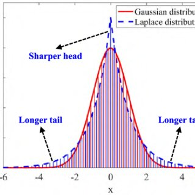

regression model에서 기본적으로 mse loss를 사용하는데, 왜 그런걸까?
나 기본기 진짜 부족하구나...ㅎㅎ

개념 한번 정리해보자.

## 들어가며

Regression 모델에서 기본적으로 MSE loss를 사용하는데, 왜 그럴까?
단순히 "성능이 잘 나와서"가 아니라, **이론적 배경**이 있다.

> [링크드인 이제헌님 글]
> error term을 Gaussian으로 가정하고 maximum likelihood estimation 관점에서 해석할 수 있기 때문입니다. 
> 그 가정의 배경에는 중심극한정리(central limit theorem)가 있습니다. 
> linear regression과 같은 생각의 흐름을 deep networks에서도 적용할 수 있는 것까지 이해하면, deep networks에서도 regression 문제를 풀 때 MSE loss를 쓰는 게 자연스러워집니다. 
> 그리고, MSE loss외에 다른 loss를 쓰려면 충분한 rationale이 필요하다는 것을 이해하게 됩니다.

---

## 1. MSE Loss의 이론적 배경

### 1.1 중심극한정리(Central Limit Theorem)

측정 오차는 일반적으로 **여러 작은 독립적인 요인들의 합**으로 구성됨:

```
오차 = 센서 노이즈 + 환경 변화 + 측정 타이밍 + ...
```

중심극한정리에 따르면, 
> 독립적인 확률변수들의 합(표본평균)은 표본 크기가 충분히 크면 **정규분포(Gaussian distribution)**에 근사합니다.

따라서:
- 오차항 ε ~ N(0, σ²)로 가정하는 것이 합리적
- 이는 단순한 편의가 아니라 **통계학적 근거**가 있는 가정

### 1.2 Maximum Likelihood Estimation (MLE)

회귀 모델을 다음과 같이 표현할 수 있습니다:

```
y = f(x; θ) + ε,  ε ~ N(0, σ²)
```

이는 다음과 같이 확률 모델로 해석됩니다:

```
p(y | x, θ) = N(f(x; θ), σ²)
```

**Likelihood function**:

```
L(θ) = ∏ᵢ p(yᵢ | xᵢ, θ) = ∏ᵢ (1/√(2πσ²)) exp(-(yᵢ - f(xᵢ; θ))²/(2σ²))
```

**Log-likelihood**:

```
log L(θ) = Σᵢ [-1/2 log(2πσ²) - (yᵢ - f(xᵢ; θ))²/(2σ²)]
```

**MLE는 log-likelihood를 최대화**하는데, 이는 다음과 같이 정리됨:

```
maximize log L(θ) ⟺ minimize Σᵢ (yᵢ - f(xᵢ; θ))²
```

> **💡 핵심 개념**  
> **MSE loss는 Gaussian noise 가정 하에서 MLE의 결과**. 즉, MSE를 최소화하는 것 = 데이터의 likelihood를 최대화하는 것.

### 1.3 MSE와 σ²의 관계

모델에서 ε ~ N(0, σ²)로 가정했을 때, **MSE는 일반적으로 σ²보다 크거나 같다**.

**Bias-Variance Decomposition** 관점에서:

$$
E[(y - \hat{y})^2] = \underbrace{(E[\hat{y}] - f(x))^2}_{\text{Bias}^2} + \underbrace{\text{Var}(\hat{y})}_{\text{Variance}} + \underbrace{\sigma^2}_{\text{Irreducible Error}}
$$

이를 다음과 같이 정리할 수 있다:

$$
\text{총 오차 (MSE)} = \text{모델 오차} + \text{데이터 오차}
$$

$$
\text{MSE} = \underbrace{\text{Bias}^2 + \text{Variance}}_{\text{모델 오차}} + \underbrace{\sigma^2}_{\text{데이터 오차}}
$$

여기서:
- **모델 오차 (Reducible Error)**: 모델 자체의 한계로 인한 오차
  - **Bias²**: 모델의 예측 평균과 실제 함수 f(x) 간의 차이 (모델이 데이터 생성 과정을 얼마나 잘 근사하는지)
  - **Variance**: 모델 예측값의 분산 (훈련 데이터의 작은 변화에 얼마나 민감한지)
- **데이터 오차 (Irreducible Error)**: σ²로 표현되는 데이터 자체의 노이즈로 인한 오차. 모델이 아무리 완벽해도 줄일 수 없는 오차

### 불확실성 관점에서의 해석

Bias-Variance Decomposition의 각 구성요소를 불확실성 모델링 관점에서 해석할 수 있다:

| 통계적 구성요소               | 의미                     | 불확실성(모델링) 관점                         |
| ---------------------- | ---------------------- | ------------------------------------ |
| Bias²                  | 모델의 구조적 한계로 인해 발생하는 오차 | **Epistemic Uncertainty** (지식 부족)    |
| Variance               | 훈련 데이터 변화에 대한 민감도      | **Epistemic Uncertainty** (데이터 부족)   |
| Irreducible Error (σ²) | 데이터 생성 과정 자체의 노이즈      | **Aleatoric Uncertainty** (본질적 무작위성) |

**핵심 포인트**:
- 모델이 완벽하면 (Bias = 0, Variance = 0): **MSE = σ²**
- 실제로는 모델이 완벽하지 않으므로: **MSE ≥ σ²**
- 따라서 σ²는 MSE의 **하한선(lower bound)**입니다

실제 회귀 문제에서:
- 모델이 데이터 생성 과정을 완벽히 학습하면 → MSE ≈ σ²
- 모델이 부족하거나 과적합되면 → MSE > σ²

### 1.4 MSE는 조건부 평균을 추정

MSE loss의 또 다른 중요한 특성:

```
argmin E[(y - ŷ)²] = E[y | x]  (조건부 평균)
```

즉, **MSE loss를 최소화하면 조건부 평균(conditional mean)**을 추정하게 됨.

이 부분은 직관적으로도 이해해볼 수 있음.
y = 1, 3, 8, 10, 100 등이 있을 때 mse를 최소화하는 y hat은 mean이 되기 때문.

---

## 2. Loss Function 비교

### 2.1 수학적 정의

| Loss | 수식 | 미분 | 노이즈 분포 |
|------|------|------|------------|
| **MSE** | $\frac{1}{n}\sum(y_i - \hat{y}_i)^2$ | $2(y - \hat{y})$ | Gaussian: $p(\epsilon) \propto \exp(-\epsilon^2/2\sigma^2)$ |
| **MAE** | $\frac{1}{n}\sum\|y_i - \hat{y}_i\|$ | $\text{sign}(y - \hat{y})$ | Laplace: $p(\epsilon) \propto \exp(-\|\epsilon\|/b)$ |
| **Huber** | $L_\delta = \begin{cases} \frac{1}{2}(y - \hat{y})^2 & \text{if } |y - \hat{y}| \leq \delta \\ \delta|y - \hat{y}| - \frac{1}{2}\delta^2 & \text{if } |y - \hat{y}| > \delta \end{cases}$ | Smooth | Robust mixture |
| **Quantile** | $L_\tau = \sum_i \rho_\tau(y_i - \hat{y}_i)$ where $\rho_\tau(u) = u(\tau - \mathbf{1}\{u < 0\})$ | $\tau$ or $\tau-1$ | Asymmetric Laplace |

### 2.2 노이즈 분포 비교

**Gaussian Distribution (MSE)**:
```
p(ε) = (1/√(2πσ²)) exp(-ε²/(2σ²))
```
- Tail이 빠르게 감소 (exponential decay of ε²)
- Outlier에 민감 (제곱 penalty)

**Laplace Distribution (MAE)**:
```
p(ε) = (1/2b) exp(-|ε|/b)
```
- Tail이 Gaussian보다 느리게 감소 (exponential decay of |ε|)
- Outlier에 robust (선형 penalty)

**Huber Loss의 동작 원리**:
```
L_δ(y, ŷ) = {
  1/2 · (y - ŷ)²          if |y - ŷ| ≤ δ  (작은 오차: MSE처럼)
  δ · |y - ŷ| - 1/2 · δ²  if |y - ŷ| > δ  (큰 오차: MAE처럼)
}
```
- δ는 threshold parameter (일반적으로 1.0 또는 1.35)
- 작은 오차: squared penalty (MSE의 효율성)
- 큰 오차: linear penalty (MAE의 robustness)
- **목적**: MSE와 MAE의 장점을 결합

**Quantile Loss(Pinball loss)의 동작 원리**:
```
L_τ(y, ŷ) = Σᵢ ρ_τ(yᵢ - ŷᵢ)

where ρ_τ(u) = {
  τ · u      if u ≥ 0  (과소예측에 대한 penalty)
  (τ-1) · u  if u < 0  (과대예측에 대한 penalty)
}
```
- τ는 quantile level (0 < τ < 1)
- τ = 0.5: MAE와 동일 (중앙값)
- τ ≠ 0.5: 비대칭 penalty (예: τ=0.9는 과소예측에 더 큰 penalty)
- **목적**: 특정 quantile 추정 및 불확실성 모델링

<figure>
  
  <figcaption>Laplace 분포(적합: MAE)와 Gaussian 분포(적합: MSE) 형태 비교</figcaption>
</figure>

### 2.3 추정량 비교

| Loss | 추정량 | 노이즈 가정 | Robustness | 사용 이유 |
|------|--------|------------|------------|-----------|
| **MSE** | Conditional Mean | Gaussian | 낮음 (Outlier에 약함) | 안정적, 이론 기반, 미분 가능 |
| **MAE** | Conditional Median | Laplace | 높음 | Outlier에 robust |
| **Quantile** | Conditional Quantile | Asymmetric Laplace | 조절 가능 | 리스크/불확실성 모델링 |
| **Huber** | Hybrid | Robust mixture | 중간 | MSE와 MAE의 장점 결합 |

---

## 3. Loss 선택의 원칙

> Loss 선택은 **실험이 아니라 가설 기반**이어야 함!

### 3.1 올바른 접근

**"왜 MAE를 쓰나요?"**
- ✅ Outlier가 많은 환경이라는 **데이터 기반 가설**
- ✅ Laplace 분포를 가정할 수 있는 **이론적 근거**
- ✅ 중앙값이 평균보다 적합한 **도메인 특성**

**"왜 Quantile loss를 쓰나요?"**
- ✅ 불확실성/분포 tail을 모델링하려는 **명확한 목적**
- ✅ Upper/lower bound estimation이 필요한 **비즈니스 요구사항**
- ✅ Risk-sensitive decision making

**"왜 Huber loss를 쓰나요?"**
- ✅ 대부분은 Gaussian이지만 **가끔 outlier**가 존재
- ✅ MSE의 효율성과 MAE의 robustness **둘 다** 필요
- ✅ 실제 데이터 분포가 **heavy-tailed Gaussian**

### 3.2 잘못된 접근

❌ "여러 loss를 실험해봤는데 이게 0.01% 더 좋아요"
- 통계적 유의성이 없을 수 있음
- 내일의 데이터에서는 역전될 수 있음
- 과적합의 위험

> [링크드인 이제헌님 글]
> Regression에서 성능이 나오지 않을 때 **그저 잘되기를 바라면서 다양한 loss를 실험해보는 것은 지양**해야 합니다.  
> 
> 회사에서의 AI는 오늘의 데이터에만 잘 작동하는 것이 아니라 **내일과 N일 후의 데이터에서도 잘 동작**해야 하기 때문에, marginal한 향상보다는 **안정적으로 작동하는 방법론**을 선택하는 것이 기본입니다.

올바른 순서:
```
가설 수립 → 수학적 배경 확인 → 모델링 목적 정의 → Loss 선택 → 실험 검증
```

---

## 4. 실전 활용

### 4.1 MAE Loss는 언제?

> [링크드인 이제헌님 글]
> 그렇다면 MAE loss는 언제 합리적일까요? MSE는 조건부 평균을, MAE는 조건부 중앙값을 추정합니다. 
> 중앙값이 평균보다 적합한 상황, 예를 들어 heavy-tailed noise나 outlier가 많은 경우라면 MAE가 자연스러운 선택이 됩니다. 
> 이 개념을 이해하면 MAE loss를 일반화해 quantile regression까지도 확장해볼 수 있습니다.

MSE는 **조건부 평균**, MAE는 **조건부 중앙값**을 추정합니다.

**적합한 경우**:
- Heavy-tailed noise가 예상되는 경우
- Outlier가 많은 데이터 (예: 금융, 센서 데이터)
- 중앙값이 평균보다 의미 있는 도메인
- Robustness가 중요한 경우

**예시**:
```python
# Outlier에 민감하지 않은 모델이 필요할 때
loss = nn.L1Loss()  # MAE
```

### 4.2 Quantile Regression

> MAE loss를 일반화하면 **quantile regression**까지 확장이 가능하다.

```python
def quantile_loss(y_true, y_pred, quantile):
    error = y_true - y_pred
    return torch.mean(torch.max(quantile * error, (quantile - 1) * error))
```

**Quantile loss**:
```
L_τ(y, ŷ) = Σᵢ ρ_τ(yᵢ - ŷᵢ)

where ρ_τ(u) = u(τ - 𝟙{u < 0})
            = τ·u      if u ≥ 0
              (τ-1)·u  if u < 0
```

- τ = 0.5: MAE와 동일 (중앙값)
- τ = 0.9: 90th percentile 추정
- τ = 0.1: 10th percentile 추정

### 4.3 불확실성 모델링

> [링크드인 이제헌님 글]
> 그럼 이걸 알면 어떤 부분에서 현업에 도움을 받을 수 있을까요? 우리는 종종 deep networks에서 불확실성을 모델링해야할 필요가 있습니다. 
> 이 때 quantile regression을 한가지 방법으로 고려해볼 수 있습니다. 
> 특히, UCB(upper confidence bound)가 필요한 상황에서 아주 간단하게 불확실성을 모델링하고 baseline으로 사용할 수 있게 됩니다. 
> 이런 내용들에 대한 이해가 얕으면, 불확실성을 모델링하기 위해 가장 유명한 monte carlo dropout 방법을 일단 시도하게 되고, 현실적으로 overconfident 문제 등 제대로 불확실성이 모델링이 안되는 현상을 경험하면서 시행착오가 늘어납니다.

Deep networks에서 불확실성을 모델링해야 할 때:

**방법 1: Quantile Regression (간단, baseline)**
```python
# Upper Confidence Bound (UCB) 추정
model_upper = train_with_quantile_loss(quantile=0.9)
model_lower = train_with_quantile_loss(quantile=0.1)

# Confidence interval
confidence_interval = model_upper(x) - model_lower(x)
```

**장점**:
- 구현 간단, 빠른 baseline
- UCB가 필요한 상황에서 즉시 활용 가능
- 해석이 명확

**방법 2: Monte Carlo Dropout (복잡)**
- 이론적 이해 없이 시도하면 overconfident 문제 발생
- 불확실성이 제대로 모델링 안 될 수 있음
- 시행착오 증가

> **💡 팁**  
> 불확실성 모델링이 필요하다면, **quantile regression을 먼저 baseline**으로 시도해보세요. 간단하고 해석 가능하며, UCB/LCB를 직접 추정할 수 있습니다.

---

## 5. 핵심 정리

### MLE 관점에서 이해

```
Gaussian noise 가정
    ↓
Maximum Likelihood Estimation
    ↓
MSE Loss 도출
```

### Loss 선택 체크리스트

1. ✅ **데이터 특성 파악**: 노이즈 분포는? Outlier가 많은가?
2. ✅ **도메인 지식 활용**: 평균 vs 중앙값 중 무엇이 의미 있는가?
3. ✅ **모델링 목적 정의**: Point estimate? Uncertainty? Quantile?
4. ✅ **이론적 근거 확립**: 왜 이 loss가 적합한가?
5. ✅ **실험 검증**: 가설이 맞는지 확인

### 기억할 점

> **📌 요약**  
> - **MSE**: 이론적 기반이 탄탄, 안정적, 기본 선택  
> - **MAE**: Outlier에 robust, 중앙값 추정, 근거 필요  
> - **Quantile**: 불확실성 모델링, 명확한 목적 필요  
> - **실험만으로는 부족**: 가설 → 이론 → 실험

> Loss function 선택은 단순한 실험이 아니라 **데이터에 대한 가정과 모델링 목적에 대한 이해**에서 시작되어야 함.


